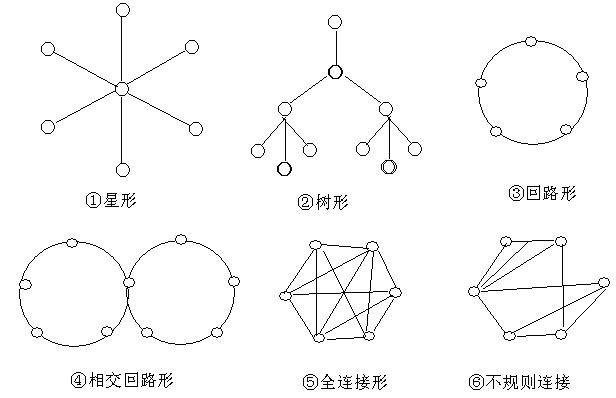
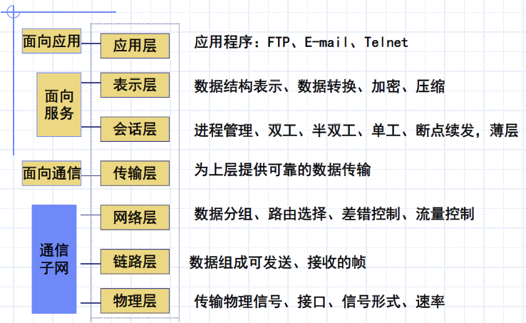
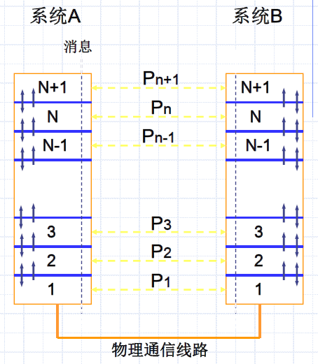
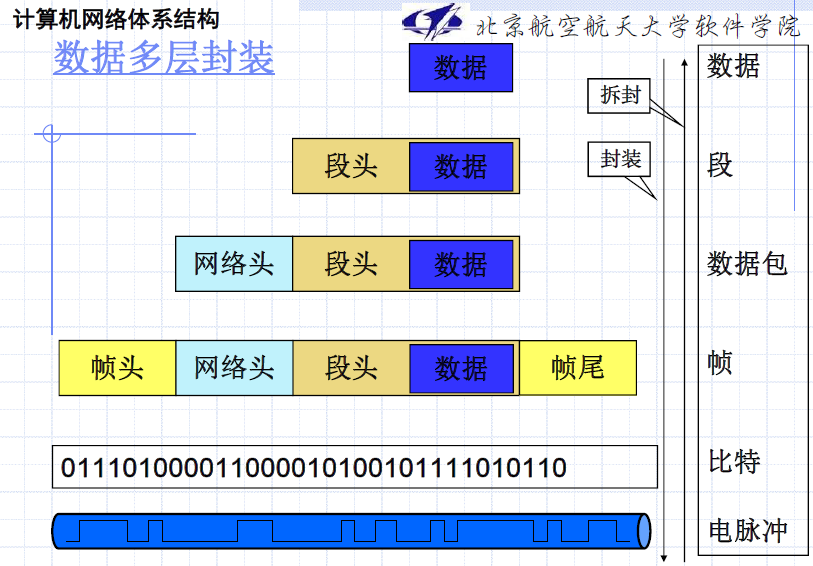
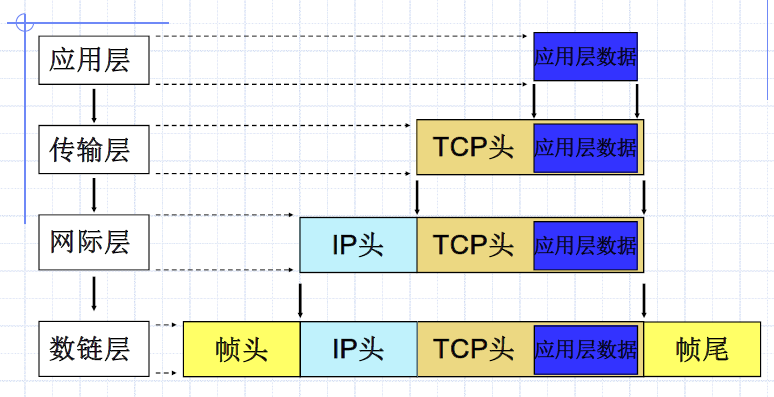

# Chapter 1 计算机网络概述

## 1 什么是Computer Network?

计算机网络的发展过程是计算机与通信（C&C, Computer and Communication）的融合过程。

1960s：面向终端分布的计算机系统

1970s：“存贮转发－分组交换”思想——出现分组交换数据网（PSDN）

- DARPA（Defense Advanced Research Project Agency）及其ARPANET

1980s：LAN、**互连网**、计算机局域网LAN（Local Area network）。进入80年代，LAN获得蓬勃发展。

- 国际标准化组织ISO（International Standards Organization）于1984年正式颁布了一个称为“**开放系统互连基本参考模型**”**OSI**（Open System Interconnection Basic Reference Model）的国际标准 ISO/OSI 7498。

1990s - now：现代网络技术、协同计算、网格技术、新的网络结构和体系

- 高速以太网，三层交换、ATM、VLAN、光纤技术的发展解决了线路传输速度慢的问题
- 计算机支持的协同工作：地域分散的一个群体借助计算机及其网络技术，共同协调与协作来完成一项任务

核心思想：

- 分层次解决问题
- 存储 - 转发的通讯方式

## 2 计算机网络的发展

Internet 发展概况：

- 1969年，美分组交换网ARPANET投入运行，使用网络控制协议（NCP）、
- 1973年，引进传输控制协议（TCP)
- 1982年，标准化为TCP/IP协议组
- 1983年，取代NCP，作为标准组件嵌入UNIX OS
- 1985年，NSF围绕其六个大型计算机中心建立计算机网络，建立了NSFNET（主干网、地区网和校园网）覆盖全美主要大学和研究所。后来 NSFNET 接管了 ARPANET，并改名为Internet。
- 1989年， NSFNET主干网的速率提高到T1（1.544Mb/s）的速率。
- 1993年，NSFNET主干网的速率升级到T3（45Mbps）的速率。
- 1996年，155Mbps，622Mb/s(光纤网)
- 美国骨干网带宽1.2Tbps/1996, 21Tbps/1999, 99Tbps/2001

### 2.1 计算机网络的定义

- 主体：多台计算机
- 媒介：通信媒介（传输媒介）
- 目的：通信与资源共享

定义：网络就是一些如工作站、个人计算机、打印机、终端机等的节点通过硬件的相互实际联机**连接**，达到数据、影音等的传输**通讯**，并完成彼此间的软硬件**资源共享**目的的结构

### 2.2 计算机网络的分类

#### 2.2.1 按地域范围

**广域网 **WAN（几十到几千km），**城域网** MAN（5~50km），**局域网 **LAN（1km左右），**个人区域网 **PAN（10m左右）

#### 2.2.2 按拓扑结构

用所构成的网络几何构形，来体现网络各组成成分之间的结构关系，从而反映了整个网络的整体。。 结构外貌。

#### 2.2.3 按信息传输交换方式

电路交换和分组交换

#### 2.2.4 按网络组件属性

**公用网**：由国家电信部门组建、经营管理、提供公众服务

**专用网**：由一个政府部门或一个公司等组建经营

### 2.3 计算机网络的作用

信息共享；以网络为核心的信息时代；已经成为社会的基础设施之一

### 2.4 计算机互联所面临的问题

要求：健壮、简单、可靠；

数据传输、高可生存性、不同类型计算机、冗余性、简单

通讯本身的问题－寻址、编码、差错控制。

如何互联－不同的硬件、不同的软件。

——采用分层方法。要解决的问题：

- 有哪些层次？每层功能是什么？（分层与功能）
- 各层间关系？如何进行交互？（服务与接口）
- 通信双方数据传输遵循规则？（协议）

#### 网络协议三要素

计算机网络通讯协议：计算机在**内容、格式、传送顺序**等方面遵守的规则、标准或约定

1. **语义**：构成协议的元素（通讯的控制信息或命令和应答）的含义，不同类型的协议元素组成了通讯双方通讯所表达的格式不同
2. **语法**：数据或控制信息的数据的结构形式或格式。
3. **时序**：计算机网络在通讯中，信息的每一个单元或事件的传送或执行顺序。

## 3 计算机网络体系结构

### 3.1 ISO/OSI 参考模型（OSI/RM）

开放系统互联参考模型（Open System Interconnection Reference Model）1982 OSI/RM (ISO 7499)；GB9387

- 7层结构，是合法标准

#### 3.1.1 OSI 各层的功能

链路层：会有校验位，防止物理层传输出错

#### 3.1.2 对等通信的实质

每一层必须依靠==相邻层==提供的服务来与另一台主机的对应层通信

- 上层使用下层提供的服务——Service user
- 下层向上层提供服务——Service provider

对等层实体之间虚拟通信；下层向上层提供服务；实际通信在最底层完成：

OSI参考模型中，对等层协议之间交换的信息单元统称为**协议数据单元**（PDU，Protocol Data Unit）

- 传输层及以下各层的PDU还有各自特定的名称：

  |     层     |        PDU名称         |
  | :--------: | :--------------------: |
  |   传输层   |   数据段（Segment）    |
  |   网络层   | 分组（数据报，Packet） |
  | 数据链路层 |    数据帧（Frame）     |
  |   物理层   |      比特（Bit）       |

#### 3.1.3 数据封装

一台计算机要发送数据到另一台计算机，数据首先必须打包，打包的过程成为封装。

- 封装：在数据前面**加上特定的协议头部**。

OSI参考模型中每一层都要**依靠下一层提供的服务**。下层把上层的PDU作为本层的**数据封装**，然后加入本层的头部（和尾部）。头部中含有完成数据传输所需的**控制信息**。

> 数据自上而下递交的过程实际上就是不断封装的过程。到达目的地后自下而上递交的过程就是不断拆封的过程。由此可知，在物理线路上传输的数据，其外面实际上被包封了多层“*信封*”。
>
> 但是，某一层只能识别由对等层封装的“信封”，而对于被封装在“信封”内部的数据仅仅是拆封后将其**提交给上层，本层不作任何处理**。
>
> 实例：TCP/IP协议的封装
>
> 

1. **物理层**（Physical）
   - 实现在物理媒体上透明地传送原始比特流。
   - 定义了激活、维护和关闭终端用户之间机械的、电气的、过程的和功能的特性。
   - 数据终端设备DTE（处理用户数据）：计算机、路由器；
   - 数据通信设备DCE（把DTE发出的数字信号转换成适于在传输介质上传输的形式）：MODEM

2. **数据链路层**（Data Link）
   - 在物理线路上提供可靠的数据传输，使之对网络层呈现为一条无错的线路
   - 广播式信道问题
3. **网络层**（Network）
   - 在源端与目的端之间建立、维护、终止网络的连接。
   - 功能和服务
   - 路由选择
4. **传输层**（Transport）
   - 为源端主机到目的端主机提供可靠的数据传输服务；屏蔽各类通信子网的差异，使上层不受通信子网技术变化的影响。
   - 进行数据分段并组装成报文流；
   - 提供“面向连接”（虚电路）和“无连接”
   - （数据报）两种服务；
   - 传输差错校验与恢复；
   - 流量控制
5. **会话层**（Session）
   - 建立、管理和中止不同机器上的应用程序之间的会话。
6. **表示层**（Presentation）
   - 处理被传送数据的表示问题，即信息的语法和语义。如有必要，使用一种通用的数据表示格式在多种数据表示格式之间进行转换。
7. **应用层**（Application）
   - 为用户的应用程序提供网络通信服务；识别并证实目的通信方的可用性；使协同工作的应用程序之间进行同步；判断是否为通信过程申请了足够的资源

### 3.2 TCP/IP 协议集（TCP/IP Suite）

Transmission Control Protocol and Internet Protocol Suite

- 4层结构，是事实上的标准