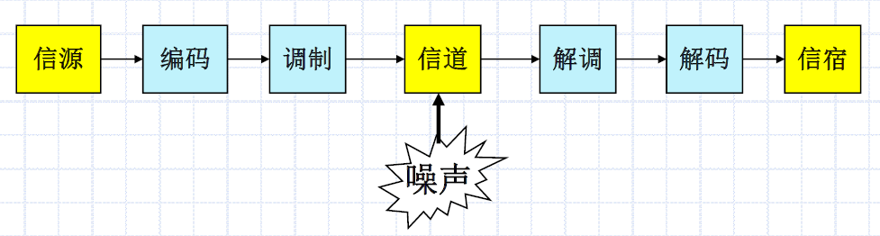
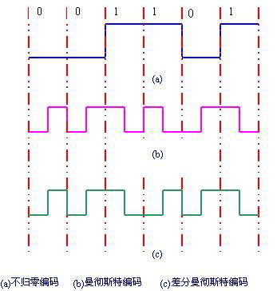

# Chapter 2 物理层

## 1 基本概念

### 1.1 物理层的任务

- 将原始的bit流从一台机器上传输到另一台机器上
- 确定与传输媒体的接口特性
  - 机械特性
  - 电气特性
  - 功能特性
  - 规程特性

### 1.2 通讯系统基础

信息通过通信系统传输，通信系统的任务：把携带信息的数据用物理信号形式通过介质传送到目的地。

> 信息和数据（0、1比特）不能直接在介质上传输

#### 傅里叶变换

由于信号在传输过程中会损失一些能量，引起增幅的减小，但是线路对于不同的傅立叶分量的衰减不同，因此叠加之后的信号出现了变形。

因此即使是在**无噪音**（干扰）的情况下，由于信号的衰减，一条信道的**传输率也是有一定范围的**，奈奎斯特定理描述了这一情况。

香农进一步研究了在**有噪音**的情况下信道的最大传输率问题。

- 信道（Channel）：向某一个方向传输信息的媒体。
- 信号（Signal）：数据的电气的或者电磁的表现。
- 带宽：带宽通常指信号所占据的频带宽度；在被用来描述**信道**时，带宽是指能够有效通过该信道的信号的==最大频带宽度==。对于模拟信号而言，带宽又称为**频宽**，**以赫兹（Hz）为单位**。
- 码元（Code Cell）：时间轴上的一个信号编码单元
- 波特（Baud）：码元传输速率的单位
- 比特率（Bit Rate）：数据传输速率（bps，b/s）

#### 通信系统模型

通信三要素：信源、信宿和信道

任何一个通信系统都可以抽象为以下模型：

- 编码器：数据 -> 适合传输的信号 —— 便于识别、纠错
- 调制器：信号 -> 适合传输的形式 —— 按频率、幅度、相位
- 解码器：传输信号 -> 原始数据
- 解调器：接收波形 -> 数字信号序列

#### 基本概念

- 信源：产生要传输数据的设备；
- 信宿：从接收器获取传送来的信息的设备：
- 调制、解调
  - 将**数字数据转换为模拟信号**的过程称之为调制；有调幅、调频、调相三种基本方式。
  - 将**模拟信号转换为数字数据**的过程称之为解调

#### 编码

曼彻斯特编码和差分曼彻斯特编码

- **曼切斯特编码**：利用跳变来表示1/0

- **差分曼切斯特编码**：前半个码元的电平与前一个码元的后半个码元电平一样为1，反之为0。

  

  

### 1.3 两个公式

#### 用于理想低通信道——**尼奎斯特（Nyquist）公式**

计算信道最大数据传输率
$$
C=2W\log_2M
$$

- C = 传输率，单位bps
- W = 带宽，单位Hz
- M = 信号电平级数

> 实际的信道存在三类损耗：衰减、延迟、噪声
>
> - 衰减：信道的损耗引起信号强度减弱，导致**信噪比S/N降低。**
> - 延迟：信号中的各种频率成分在信道上的延迟时间**各不相同**，在接收端会产生信号畸变。
> - 噪声：
>   - 热噪声：由导体内的热扰动引起，又称为白噪声。
>   - 串扰：信道间产生的不必要的耦合。例：多对双绞线
>   - 脉冲噪声：非连续、随机、振幅较大。多由外部电磁干扰造成（闪电、大功率电机启动等）。
>   - 噪声将**破坏信号，产生误码**。持续时间0.01s的干扰可以破坏约560个比特（56Kbps）。

#### 非理想信道传输率计算公式——**香农（Shannel）公式**

$$
C=W\log_2(1+\frac{S}{N})
$$

- C = 传输率，单位bps

- W = 带宽，单位Hz

- 信噪比：$S/N_{dB}=10\log_{10}S/N$，即 $S/N=10^{(S/N_{dB})/10}$，==公式里用的是 $S/N$，题目基本给的是 $S/N_{dB}$==

  > 例：信道带宽 $W=3KHz$，信噪比为30dB，则 $C=3000*log_2(1+1000)≈30Kbps$

#### 比较

Nyquist 公式：此公式说明数据传输率C随信号编码级数增加而增加。

Shannel 公式：无论采样频率多高，信号编码分多少级，此公式给出了信道能达到的最高传输速率。

原因：**噪声的存在将使编码级数不可能无限增加**。

## 2 传输媒体

磁介质

- 高带宽、低费用、高延时（小时）

  > 例：7GB/8mm，1000盘/$50*50*50cm$，24h可送到任何地方。
  >
  > 总容量 = $7*1000*8Gbits$，总时间 = $24*60*60=86400s$
  >
  > 传送速率 = $56000Gb/86400s=648Mb/s$

金属导体

- 双绞线：成本低；密度高、节省空间；安装容易（综合布线系统）；平衡传输（高速率）；抗干扰性一般；连接距离较短 
- 同轴电缆（粗、细）：基带、宽带；细、粗

光纤

无线介质

- 无线电、短波、微波、卫星、光波

## 3 物理设备

中继器

- 一个将输入信号增强放大的**模拟**设备，而**不考虑输入信号种类**（是模拟的还是数字的）
- 中继器是用来==加强缆线上的讯号==，把信号送得更远，以延展网络长度。当电子讯号在电缆上传送时，讯号强度会随着传递长度的增加而递减。因此需要中继器将讯号重新加强以增加资料的传送距离。

集线器（Hub）

- 将多条以太网路双绞线或光纤集合**连接在同一段物理介质下**的装置。