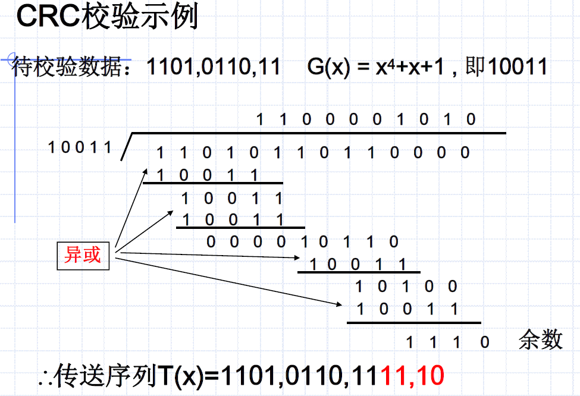
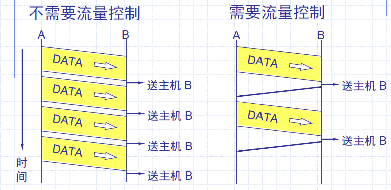
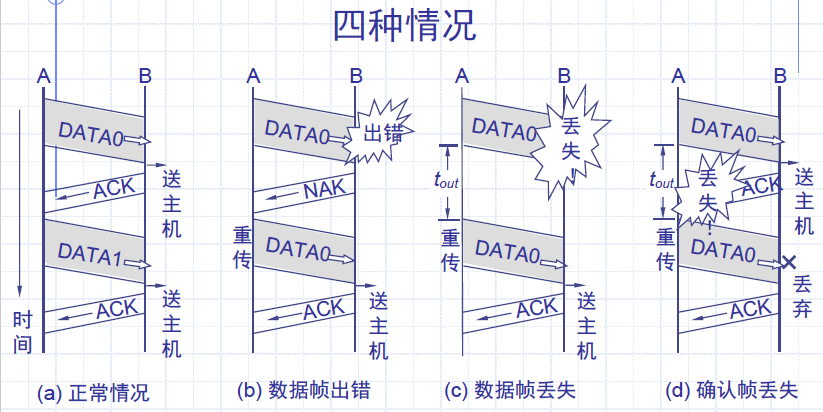
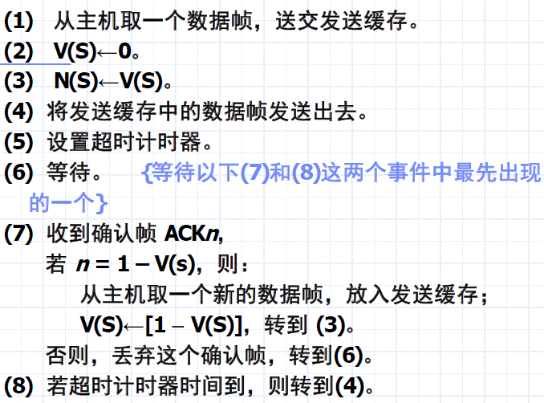
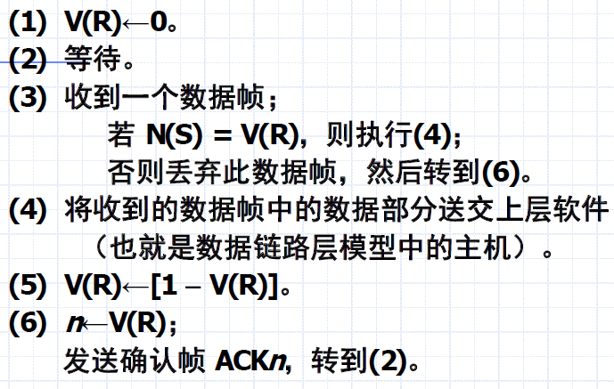
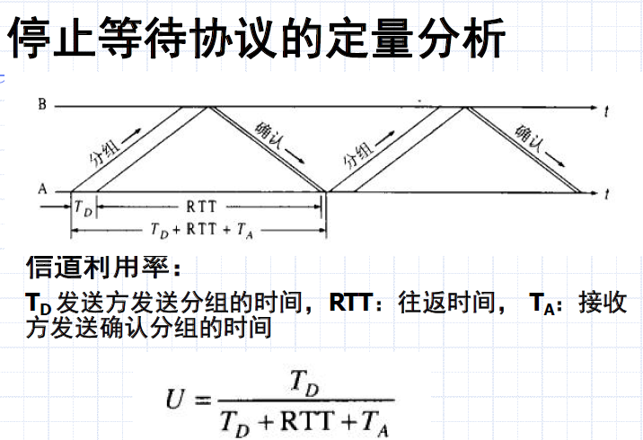
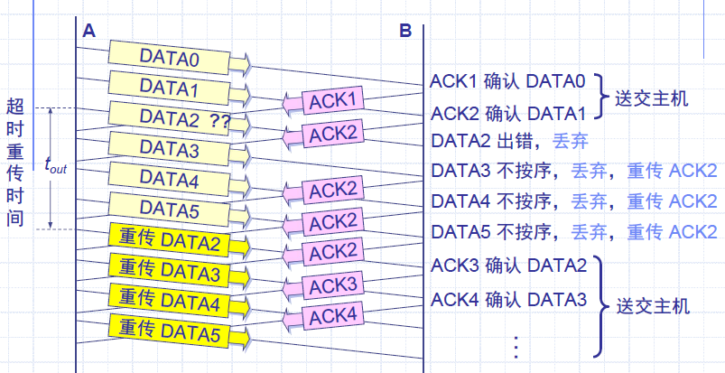
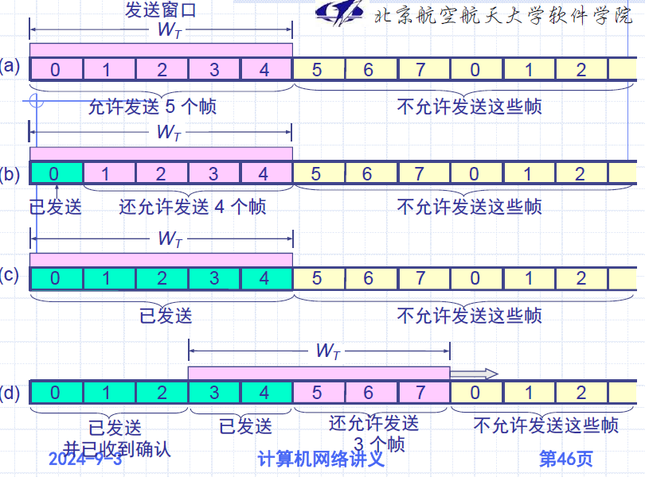
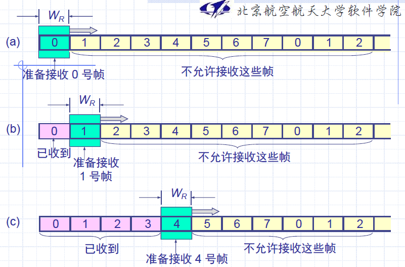

# Chapter 3 数据链路层

[TOC]

## 1 基本概念

### 1.1 定义

要解决的问题：如何在有差错的线路上，进行无差错传输

ISO对数据链路层的**定义**：数据链路层的目的是为了提供**功能上和规程上的方法**，以便建立、维护和释放网络实体间的数据链路。

**结点**（node）：网络中的主机（host）和路由器（router）称为结点。

**链路**（link）：通信路径上连接**相邻结点**的通信信道称为链路。

数据链路层协议定义了一条链路的两个结点间交换的数据单元格式（帧），以及结点发送和接收数据单元的动作。

**端到端通信**：从源结点（source node）到目的结点（destination node）的通信，通信路径（path）可能由多个链路组成。

**点到点通信**：在相邻结点间的一条链路上的通信。

**数据链路控制规程**：为使数据能迅速、正确、有效地==从发送点到达接收点==所采用的控制方式。

数据链路层协议应提供的**最基本功能**：

- **链路管理**：数据链路的建立、维护和释放
- **定界与同步**：能够从接受到的比特流当中准确的区分出一帧的开始和结束
- **差错控制**：纠错和差错检测
- **流量控制**：调节通讯双方通讯速度
- **寻址**：确保每一帧能够到达正确的目的端

### 1.2 为网络层提供服务

三种合理的服务：

- 无确认无连接服务：源主机发送不需要建立链路连接，目的主机收到帧不需要发回确认，适用于
  - 误码率很低的线路，错误恢复留给高层
  - 实时业务
  - 大部分局域网
- 有确认无连接服务：发送帧无需建立链路链接，但收到帧必须发回确认。适用于不可靠的信道，如无线网
- 有确认有连接服务

> 有连接就一定有确认，亦即不存在无确认面向连接的服务

## 2 错误检测和纠正

差错出现的特点：==随机，连续突发==

- 信道的电气特性引起信号幅度、频率、相位的畸变
- 信号反射
- 串扰
- 闪电、大功率电机的启停等

处理差错的两种基本策略：

- 纠错码：发送方在每个数据块中加入足够的冗余信息，使得接收方能够判断接收到的数据是否有错，**并能纠正错误**。
- 检错码：发送方在每个数据块中加入足够的冗余信息，使得接收方能够判断接收到的数据是否有错，**但不能判断哪里有错**。

差错检测两种方法：奇偶校验、循环冗余校验

### 2.1 奇偶校验（Parity Checking）

在原始数据字节的最高位增加一个附加比特位，使结果中1的个数为奇数（奇校验）或偶数（偶校验）。

增加的位称为奇偶校验位。

> 例：原始数据=1100010，采用偶校验。则增加校验位后的数据为**1**1100010

若接收方收到的字节奇偶结果不正确，就可以知道传输中发生了错误。

奇偶校验**只能检测出奇数个比特位错**，对偶数个比特位错则无能为力。

### 2.2 循环冗余校验（Cyclic Redundancy Check，CRC）

> 考试会考计算题！！！

是一种通过多项式除法检测错误的方法。

**编码思想**：将位串看成系数为0或1的多项式

**检错思想**：收发双方约定一个生成多项式G(x)（其最高阶和最低阶系数必须为1），发送方**在帧的末尾加上校验和**，使带校验和的帧的多项式能被G(x)整除。接收方收到后，用G(x)除多项式，**若有余数，则传输有错**。

CRC校验和算法：

- G(x) 最高阶为 r，在帧尾补 r 个0
- 模 2 除 G(x) 得到余数
- 将补 0 后的帧按照模 2 减法减去余数得到带校验和的帧 T(x)

国际标准：

- CRC-12 = $x^{12} + x^{11} + x^3 + x^2 + x + 1$
- CRC-16 = $x^{16} + x^{15} + x^2 + 1$
- CRC-CCITT = $x^{16} + x^{12} + x^5 + 1$
- CRC-32

硬件实现CRC校验：网卡NIC（Network Interface Card）

## 3 数据链路层协议

### 3.1 理想条件（完全理想化的数据传输）

完全理想化的数据传输所基于的2个假定：

1. 链路是理想的传输信道，所传送的任何数据既**不会出差错也不会丢失**。——可靠传输

2. 不管发方以多快的速率发送数据，收方**总是来得及收下**，并及时上交主机。——流量控制

   > 这个假定就相当于认为：接收端向主机交付数据的速率永远不会低于发送端发送数据的速率。

#### 具有最简单流量控制的数据链路层协议

- 去掉上述第二个假定，保留第一个假定。现在还不能保证接收端向主机交付数据的速率永远不低于发送端发送数据的速率。
- **由收方控制发方的数据流**，乃是计算机网络中流量控制的一个基本方法。

算法：

- 在发送节点：
  1. 从主机**取一个数据帧**。
  2. 将数据帧送到数据链路层的**发送缓存**。
  3. 将发送缓存中的数据帧**发送**出去。
  4. 等待。
  5. 若==收到由接收结点发过来的信息==（此信息的格式与内容可由双方事先商定好），则从主机取一个新的数据帧，然后转到(2)。
- 在接收节点：
  1. 等待
  2. 若==收到由发送结点发过来的数据帧==，则将其放入数据链路层的**接收缓存**。
  3. 将接收缓存中的**数据帧上交主机**。
  4. 向发送结点**发一信息**（ACK，Acknowledge character，确认帧），表示数据帧已经上交给主机。
  5. 转到(1)。

两种情况的对比（存在假定1，即传输均无差错）

### 3.2 实用的停止等待协议

> ——保证了可靠性，但效率低

**超时计时器**（timeout timer）：结点A**发送完**一个数据帧时启动。又称为**定时器**

- 若到了超时计时器所设置的重传时间 $t_{out}$ 而仍收不到结点 B 的任何确认帧，则结点 A 就**重传前面所发送的这一数据帧**。
- 一般可将重传时间选为**略大于**“从发完数据帧到收到确认帧所需的**平均时间**”。

**解决重复帧问题**：——==出现重复帧是因为前一个ACK丢失了==

- 使每一个数据帧带上不同的发送序号。每发送一个新的数据帧就把它的发送序号加 1。
- 若结点 B 收到发送序号相同的数据帧，就表明出现了重复帧。这时应丢弃重复帧，因为已经收到过同样的数据帧并且也交给了主机 B。
- 但此时结点 B **还必须向 A 发送确认帧** ACK，因为 B 已经知道 A 还没有收到上一次发过去的确认帧 ACK。

**帧的编号问题**：序号占用数据传输的额外开销；由于序号占用比特数有限，发送序号会重复

- 对停止等待协议，每发送一个数据帧就停止等待，只需**一个比特**来编号即可

**帧的发送序号**：

- 数据帧中的发送序号N(S)以0和1交替方式出现在数据帧中
- 每发一个新数据帧，发送序号就和上次的不一样，这样就能区分开新的数据帧和重传数据帧了。

**可靠传输**：虽然**物理层**传输比特时会出差错，但数据链路层的停止等待协议采用有效的**检错重传机制**，**数据链路层**对上面的**网络层**就可提供==可靠传输==的服务

#### 3.2.1 停止等待协议算法

这里**不使用否认帧**（实用的数据链路层协议大都是这样的），而且确认帧带有序号 n。

ACKn 表示“第 n – 1 号帧已经收到，现在期望接收第 n 号帧”。

N - 传输序号（路上的）；V - 本地变量（家里的）；S - 发送；R - 接收

- 发送节点

  

- 接收结点

  

#### 3.2.2 停止等待协议的要点

- ==发送端==只有收到序号正确的确认帧 ACKn 后，才**更新发送状态变量 V(S) 一次**，并发送新的数据帧。
- ==接收端==接收到数据帧时，就要将发送序号 N(S) 与**本地的接收状态变量** V(R) 相比较。
  - 相等则是新的数据帧：收下，发送确认
  - 否则是重复帧，丢弃，仍向发送端发送ACKn，而**接收状态变量 V(R) 和确认序号 n 都不变**。
- 连续出现相同发送序号的数据帧，表明发送端**超时重传**。连续出现相同序号的确认帧，表明接收端收到**重复帧**。
- 发送端发送完时，必须在发送缓存中保留该数据帧的副本，以便出错重传。只有对方确认收到这个数据帧才可清除。
- 实用的CRC检验器都用硬件完成。能自动丢弃检测到的出错帧，因此对上层软件或用户是感觉不到的。
- 发送端对出错的数据帧重传是自动的，称为**自动重传请求**（ARQ，Automatic Repeat reQuest）

设数据帧出错概率为p，假设确认帧不会出错，在不限制重传次数的情况下可计算出正确传输一帧所需平均时间 $t_{av}$。$t_{av}=t*(1+平均传输次数)=t/(1-p)$，其中平均传输次数为 $p/(1-p)$

#### 3.2.3 停止等待协议ARQ的优缺点

- 优点：比较简单。
- 缺点：通信信道利用率不高，也就是信道远没被数据比特填满。

### 3.3 连续ARQ和选择重传ARQ

#### 3.3.1 连续ARQ协议（后退n帧协议）

> ——提升了发送方的效率，但接收方会浪费很多机会

- 发送完一个数据帧后，并非停下来等待确认帧，**而是可以连续再发送若干个数据帧**
- 若此时收到了接收端发来的确认帧，那么还可以接着发送数据帧
- 减少了等待时间，整个通信的吞吐量提高

工作原理：

注意：

1. **接收端只按序接收数据帧**。虽然在有差错的 2 号帧之后接着又收到了正确的 3 个数据帧，但接收端都必须将这些帧丢弃，因为在这些帧前面有一个 2 号帧还没有收到。虽然丢弃了这些不按序的无差错帧，但应重复发送已发送过的最后一个确认帧（防止确认帧丢失）。

2. ACKn 表示确认 n-1 号帧 DATAn-1，并期望下次收到 n 号帧

3. A在每发送完一个数据帧都要设置该帧的**超时计时器**。如果在所设置的超时时间内收到确认帧，就立即将超时计时器清零。但若在所设置的超时时间到了而未收到确认帧，就要重传相应的数据帧（仍需重新设置超时计时器）。

   在等不到 2 号帧的确认（==等不到ACK3==）而重传 2 号数据帧时，虽然结点 A 已经发完了 5 号帧，但仍必须向回走，将 2 号帧及其以后的各帧全部进行重传。

   连续 ARQ 又称为Go-back-N (GBN)ARQ ，意思是当出现差错必须重传时，**要向回走 N 个帧**，然后再开始重传。
   
   > my understanding：向回走多少帧，由超时计时器的时长决定

### 3.4 滑动窗口协议

> ——有序号，有确认，带重传，既保证可靠性，又具有效率

#### 3.4.1 滑动窗口的概念

- 发送端和接收端分别设定发送窗口和接收窗口
- 发送窗口对发送端进行**流量控制**
- 发送窗口大小 $W_T$ 代表在还没有收到对方确认信息的情况下，**发送端可以最多发送多少数据帧**（有点像超时计时器？）

#### 3.4.2 接收端设置接收窗口

- 在接收端只有当==收到的数据帧的发送序号==**落入接收窗口内**才允许将该数据帧收下。
- 若接收到的数据帧落在接收窗口之外，则一律将其**丢弃**。
- 在**连续 ARQ 协议**中，接收窗口的大小 WR = 1。
  - 只有当收到的帧的序号与接收窗口一致时才能接收该帧。否则，就丢弃它。
  - 每收到一个序号正确的帧，接收窗口就向前（即向右方）滑动一个帧的位置。同时发送对该帧的确认。

#### 3.4.3 滑动窗口的重要特性

- 只有在接收窗口向前滑动时（与此同时也发送了确认），发送窗口才有可能向前滑动。
- 收发两端的窗口按照以上规律不断地向前滑动，因此这种协议又称为**滑动窗口协议**。
- 当发送窗口和接收窗口的大小都等于 1 时，就是**停止等待协议**。

**发送窗口的最大值**：

- 当用n个比特进行编号时，==若接收窗口的大小为 1==，则只有在发送窗口的大小 $W_T\le 2^n-1$​ 时，连续 ARQ 协议才能正确运行。例如，当采用 3 bit 编码时，发送窗口的最大值是 7 而不是 8。好理解。

**最佳帧长**：

- 若数据帧长太短，则控制信息所占比例增大，额外开销增大，导致信道利用率下降。
- 若帧长太长，则数据帧在传输过程中出错概率增大，于是**重传次数将增大**，这也会使信道利用率下降。
- 由此可见，存在一个最佳帧长，在此帧长下信道的利用率最高。

#### 3.4.4 选择重传ARQ协议

- 可加大接收窗口，先收下发送序号**不连续但仍处在接收窗口**中的那些数据帧。等到所缺序号的数据帧收到后再**一并送交主机**。
- 选择重传 ARQ 协议可==避免重复传送那些本来已经正确到达接收端的数据帧==。
- 但我们付出的代价是在接收端要**设置具有相当容量的缓存空间**。
- 对于选择重传 ARQ 协议，若用 n 比特进行编号，则接收窗口的最大值受下式的约束：$W_R\le2^n/2$。也就是说接收窗口必须不大于发送窗口。一般情况下，$W_T$ 和 $W_R$ 大小相同

### 3.5 HDLC和PPP

HDLC：高级数据链路控制，High-level Data Link Control

PPP：Point to Point Protocol是一个串行线路上最常用的连路通讯点对点的协议

