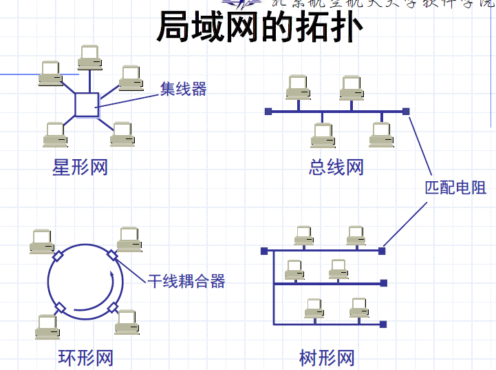
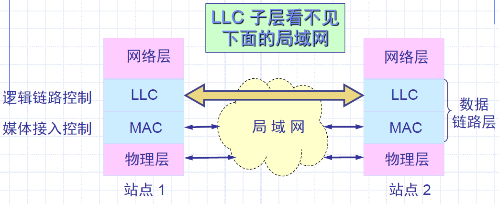
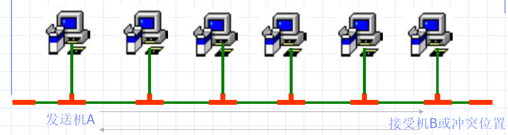
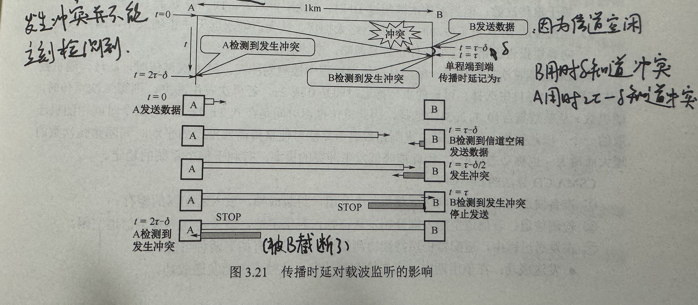
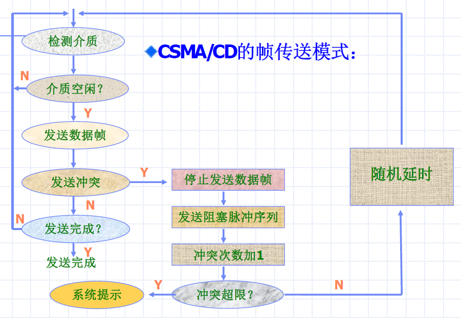
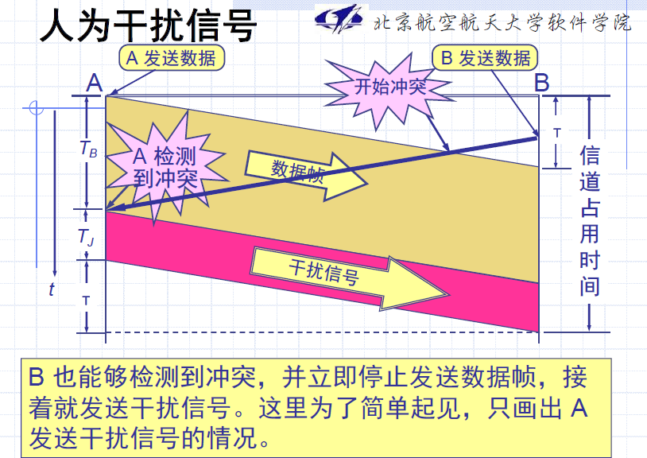
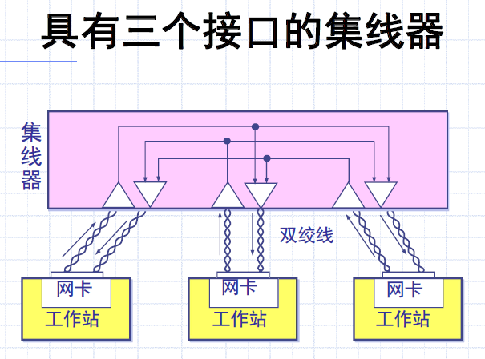
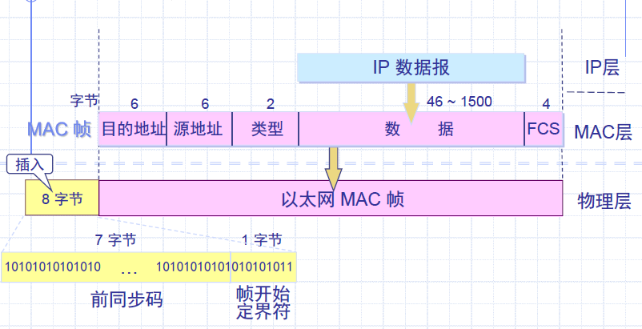
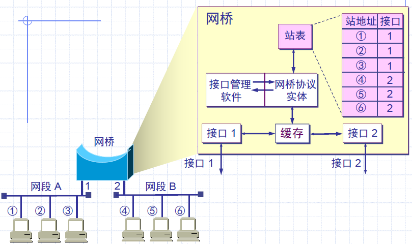
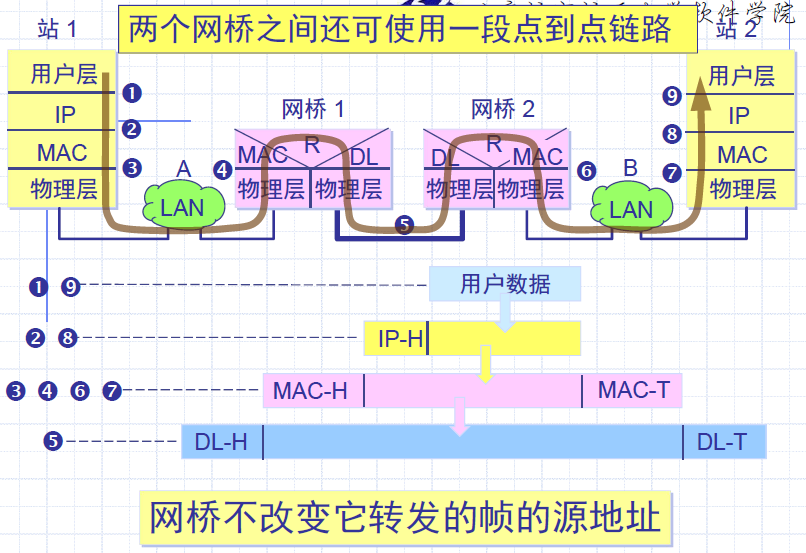

# Chapter 4 局域网

[TOC]

## 1 局域网概述

### 1.1 历史和发展

1972，Bell公司提出两种环形局域网技术

1973，发明以太网；1979，以太网标准化研究工作；1980，Ethernet V1.0以太网规范

### 1.2 LAN特性

覆盖范围有限，数据率较高，误码率较低，支持广播或组播，单一管理

**影响局域网性能的因素**：

- **传输介质**：双绞线、同轴电缆、光纤、无线等
- **网络拓扑**：总线型、星型、环型、树型等
- **MAC**（介质访问控制）协议：规定了各个站点怎样利用共享的信道，特别是在什么条件下站点可以发信
- **交换式还是共享式**：交换机 vs 集线器

**局域网最主要特点**：网络为一个单位所拥有，且地理范围和站点数目均有限

**优点**：

- 具有广播功能，从一个站点可很方便地访问全网。局域网上的主机可共享连接在局域网上的各种硬件和软件资源。
- 便于系统的扩展和逐渐地演变，各设备的位置可灵活调整和改变。
- 提高了系统的可靠性、可用性和残存性。

### 1.3 局域网拓扑

每种拓扑都有其优缺点

**星型**：一根电缆断了不会影响整个网络

**环状**：计算机容易协调；容易检测网络运行状况；一根电缆断了，整个环状网络都会失效

**总线**：所需的布线比星型少，总线断了网络就要失效

### 1.4 后面的东西

#### 媒体共享技术

静态**划分信道**：频分复用、时分复用、波分复用、码分复用

动态媒体接入控制（多点接入）：

- 随机接入
- 受控接入，如多点线路探询（polling），或轮询

#### 以太网的两个标准

1. DIX Ethernet V2 ：世界上第一个局域网产品（以太网）的规约。

2. IEEE 的 802.3 标准。

DIX Ethernet V2 标准与 IEEE 的 802.3 标准**只有很小的差别**，因此可以将 802.3 局域网简称为“以太网”。

严格说来，“以太网”应当是指符合 DIX Ethernet V2 标准的局域网。

#### 数据链路层的两个子层

为了使数据链路层能更好地适应多种局域网标准，802委员会将**局域网的数据链路层**拆成两个子层：

- **逻辑链路控制** LLC（Logical Link Control）子层：负责**数据链路层**当中==同传输媒体无关==的部分

  - 建立和释放逻辑连接

  - 提供同高层的接口

  - 差错控制

  - 给帧加上序号

  - **不管采用何种协议的局域网对LLC子层都是透明的**

    

- **媒体接入控制** MAC（Medium Access Control）子层：负责在**物理层**上的==无差别通信==

  - 将上层数据封装成帧，将帧拆卸得到数据
  - 实现和维护MAC协议
  - 比特差错检测
  - 寻址
  - **存放与接入到传输媒体有关的内容**

> 以后一般不考虑LLC子层：因为TCP/IP常用的局域网是DIX Ethernet V2 而不是 802.3 标准中的几种局域网，因此现在 802 委员会制定的逻辑链路控制子层 LLC（即 802.2 标准）的作用已经不大了。
>
> 很多厂商生产的适配器上就仅装有 MAC 协议而没有 LLC 协议。

#### 适配器的作用

网络接口板又称为**通信适配器**（adapter）或**网络接口卡**NIC（Network Interface Card），或“网卡”。

重要功能：

- 进行串行/并行转换
- 对数据进行缓存
- 在计算机的操作系统安装设备驱动程序
- 实现以太网协议

## 2 以太网技术

### 2.0 概述

以太网是最早发展起来的一种**局域网**，也是目前应用最为广泛的一种局域网；它是计算机网络的一种组建规范标准，符合这种网络组建规范，即所建的网络为以太网。

**核心思想**：

1. 使用共享的公共传输通道
2. 载波监听，多路访问

**以太网的广播方式发送**：假设B向D发送数据，总线上有ABCDE五台计算机

- 总线上每个工作的计算机都能检测到B发送的数据信号。
- 只有计算机D的地址与数据帧首部写入的地址一致，因此只有D才接收这个数据帧。
- 其他所有计算机都检测到不是发送给它们的数据帧，因此丢弃这个数据帧而不能够收下来。
- 具有广播特性的总线上实现了**一对一的通信**。

为了通信简便，**以太网采取两种重要措施**：

1. 采用较为灵活的**无连接**的工作方式，即不必先建立连接就可以直接发送数据

2. 以太网对发送的数据帧**不进行编号**，**也不要求对方发回确认**。

   ——是因为局域网信道质量很好，因信道质量产生差错的概率是很小的。

**以太网提供的服务**：

- 是==不可靠的交付==，即尽最大努力的交付
- 当目的站收到有差错的数据帧时就**丢弃此帧**，其他什么也不做。**差错的纠正由高层来决定**。
- 如果高层发现丢失了一些数据而进行重传，但以太网并不知道这是一个重传的帧，==而是当作一个新的数据帧来发送==。

以太网发送的数据都是用**曼彻斯特编码**

种类：10Mb/s Ethernet：以太网；100Mb/s：快速以太网；1000Mb/s：千兆以太网；10000Mb/s：TB级位

### 2.1 总线结构

### 2.2 CSMA/CD算法

无论使用何种Ethernet，其MAC层均采用“争用型”的介质访问控制协议，即：

载波侦听多路访问冲突检测CSMA/CD（Carrier Sense Multiple Access/Collision Detect）

- **载波监听**：每一个站在发送数据之前先要检测一下总线上**是否有其他计算机在发送数据**，如果有，则暂时不要发送数据，==以免发生碰撞==。
  - 总线上并没有什么“载波”。因此，“载波监听”就是用电子技术检测总线上有没有其他计算机发送的数据信号。

- **多路访问**：表示许多计算机以==多点接入==的方式连接在一根总线上。
- **碰撞检测**：计算机==边发送数据边检测==信道上的信号电压大小。
  - 当几个站同时在总线上发送数据时，总线上的信号电压**摆动值**将会增大（互相叠加）。
  - 当一个站检测到的信号电压摆动值**超过一定的门限值**时，就认为总线上至少有两个站同时在发送数据，**表明产生了碰撞**。
  - 所谓“碰撞”就是发生了**冲突**。因此“碰撞检测”也称为“冲突检测”。

在发生碰撞时，总线上传输的信号产生严重的失真，无法从中恢复出有用的信息。

每一个==正在发送数据的站==，一旦发现总线上出现了碰撞，就要**立即停止发送**，免得继续浪费网络资源，然后等待一段**随机时间**后再次发送。

> CSMA/CD的工作流程可概括为：“先听后发，边听边发，冲突停发，随机重发”

#### 2.2.1 以太网的CSMA控制规范

一个站要发送，先需要监听总线：

- 如果介质空闲，则可以向双向整个系统发送，到终点被终端器吸收。
- 如果介质忙，**则等待一定间隔后重试**，再监听。

一个发送主机A把信息发送给接受机B，如果传播的时间为a，则发送机A接到接受机B的确认信息（或总线的冲突信息），最大可能为2a。

#### 2.2.2 以太网的重要特性

- 使用 CSMA/CD 协议的以太网不能进行全双工通信而只能进行双向交替通信（**半双工通信**）。
- 每个站在发送数据之后的一小段时间内，**存在着遭遇碰撞的可能性**。
- 这种发送的不确定性使整个以太网的==平均通信量远小于以太网的最高数据率==

#### 2.2.3 争用期

**最先发送数据帧的站**，在发送数据帧后==至多==经过时间 2 PROP （两倍的端到端往返时延）就可知道发送的数据帧是否遭受了碰撞。

以太网的端到端往返时延 2 PROP 称为**争用期**，或**碰撞窗口**。

经过争用期这段时间还没有检测到碰撞，才能肯定这次发送不会发生碰撞。

> 为确保发送成功, 一台主机在发送结束之前必须能够检测到冲突
>
> $最小帧长= 2*Prop*传输速率$，Prop=L/0.77c（c=光速）
>
> 考虑到转发器等其他各种因素以太网取 51.2us 为征用期长度（2 PROP），10Mbps 以太网最小帧长为 512bits（争用期为512比特时间），即64字节。以太网在发送数据时，若**前 64 字节没有发生冲突**，则后续的数据就不会发生冲突。
>
> 帧间间隔：9.6us，也即96比特时间

#### 2.2.4 最短有效帧长

- 若发生冲突，就==一定是在发送的前 64 字节之内==。

- 由于一检测到冲突就立即中止发送，这时已经发送出去的数据一定小于 64 字节。

- 以太网规定了**最短有效帧长为 64 字节**，凡长度小于 64 字节的帧都是**由于冲突而异常中止的无效帧**。

  > 这个最短有效帧长 64 字节，后面MAC帧格式要用到！

### 2.2.5 CSMA等待时间算法

三种（**坚持退避算法**）

- 不坚持CSMA：如果介质空闲则发送，如果介质忙，则等一段**随机时间**重复第一步。

  > 坚持：监听到信道忙后，继续坚持监听信道

- 1 - 坚持CSMA：如果介质空闲则发送，如果介质忙，**继续监听**，**直到介质空闲立即发送**；如果发生冲突，则等一段**随机时间**重复第一步。

  > 1：监听到信道**空闲**时，立即发送帧的概率为1。降低了多个站点等待信道空闲后同时发送数据导致冲突的概率，但也增加了数据在网络中的平均时延

- ==P - 坚持CSMA==：**如果介质空闲**，则**以P的概率发送**，而以（1-P）的概率延迟一个时间单位，时间单位等于**最大的传播延迟时间**；如果介质忙，继续监听，直到介质空闲重复第一步；如果被延迟一个时间单位，则重复第一步。

  > - 只适用于时分信道
  > - p概率发送，1-p概率推迟继续监听：降低1-坚持CSMA中多个站点检测到信道空闲时同时发送帧的冲突概率
  >
  > - 坚持：克服非坚持CSMA中因随机等待造成延迟时间较长的缺点

**二进制指数类型退避算法**（truncated binary exponential type）

- 发生碰撞的站在停止发送数据后，要推迟（退避）一个随机时间才能再发送数据。
  - 基本退避时间：一般为争用期 2T。
  
  - 定义重传次数 k，$k\le10$，$k=min[重传次数，10]$。（每多一次重传，则 k++）
  
  - 从整数集合 $[0,1,...,(2^k-1)]$​ 中随机地取出一个数，记为 r。重传所需时延即 r 倍的基本退避时间。
  
    > 重传次数越多，平均重传所需时延就越长
  
  - 当重传达 16 次仍不能成功时即丢弃该帧，并向高层报告。
  
  > 使用截断二进制指数退避算法可使重传需要推迟的平均时间随重传次数的增大而增大（也叫动态退避），故能降低发生冲突的概率，有利于整个系统的稳定。

**人为干扰信号**：一般48比特时间或32比特时间

CSMA算法归纳：

1. 准备发送：适配器从网络层获得一个分组，封装成帧，放入适配器的缓存。
2. 检测信道：若信道空闲，则开始发送该帧；若信道忙，则持续检测直至信道空闲。
3. 发送过程中，适配器仍然持续监测信道。存在2种可能：
   - 发送成功：在争用期内一直未检测到冲突，该帧肯定能发送成功
   - 发送失败：在争用期内检测到冲突，立即停止发送，适配器执行指数退避算法，等待一段随机时间后返回到步骤2,。若重传16次仍不能成功，则停止重传并向上报错

### 2.3 连接方式 - HUB & Switch

#### 2.3.1 集线器（hub）

传统以太网最初是使用**粗同轴电缆**，后来演进到使用比较便宜的**细同轴电缆**，最后发展为使用更便宜和更灵活的**双绞线**。

> 以太网的**逻辑拓扑**是总线形结构，**物理拓扑**是星形结构

这种以太网采用==星形拓扑==，在星形的中心则增加了一种==可靠性非常高==的设备，叫做**集线器**（hub）

特点：

- 集线器是使用电子器件来**模拟实际电缆线的工作**，因此整个系统仍然像一个传统的以太网那样运行。
- 使用集线器的以太网在逻辑上**仍是一个总线网**，各工作站使用的**还是 CSMA/CD 协议**，并共享逻辑上的总线。
- 集线器很像一个多接口的转发器，工作在**物理层**。

#### 2.3.2 MAC 层的硬件地址

- 在局域网中，硬件地址又称为物理地址，或 MAC 地址。
- 802 标准所说的“地址”严格地讲应当是每一个站的“名字”或标识符。
- 但鉴于大家都早已习惯了<u>将这种 48 位的“名字”称为“地址”</u>，所以本书也采用这种习惯用法，尽管这种说法并不太严格。

##### 1. 48位的MAC地址（6字节）

- IEEE 的**注册管理机构** RA 负责==向厂家分配==地址字段的前三个字节（即高位 24 位）。
- 地址字段中的后三个字节（即低 24 位）由厂家自行指派，称为**扩展标识符**，必须保证生产出的适配器==没有重复地址==。
- 一个地址块可以生成 $2^{24}$ 个不同的地址。这种 48 位地址称为 MAC-48，它的通用名称是 EUI-48。
- “MAC地址”实际上就是适配器地址或适配器标识符 EUI-48。

##### 2. 适配器检查MAC地址

- 适配器从网络上每收到一个 MAC 帧，就首先用硬件检查 MAC 帧中的 MAC 地址。
  - 如果是发往本站的帧则收下，然后再进行其他的处理。
  - 否则就将此帧丢弃，不再进行其他的处理。
- “发往本站的帧”包括以下三种帧：
  - 单播(unicast)帧（一对一）：收到的帧的目的地址与本站的MAC地址相同
  - 广播(broadcast)帧（一对全体）：发送给本局域网上所有站点的（全1地址）
  - 多播(multicast)帧（一对多）：发送给本局域网上一部分站点的帧

##### 3. MAC帧的格式

- 常用的以太网MAC帧格式有两种标准 ：DIX Ethernet V2 标准、IEEE 的 802.3 标准

- 最常用的 MAC 帧是**以太网 V2 的格式**。

##### 4. 以太网的MAC帧格式

- 图中的单位为字节

- **目的地址字段**、**源地址字段**均6字节（MAC地址 EUI-48）

- **类型字段**：2字节，用来标志**上一层**使用的是什么协议（例如网络层的IP协议），以便把收到的 MAC 帧的数据==上交==给上一层的这个协议。

- **数据字段**：46~1500字节，正式名叫做MAC客户数据字段，承载上层的协议数据单元（PDU，如）。

  > 数据字段最小长度46字节 = 以太网最短帧长64字节 - 18字节的首部和尾部。
  >
  > 当数据字段长度小于46字节时，应在数据字段的后面加入**整数字节**的填充字段，以保证以太网的MAC帧长不小于64字节。

- **FCS**（Frame Check Sequence，帧校验序列）：4字节，一般采用32位CRC

- 当传输媒体的**误码率**为 $1\times 10^{-8}$ 时，MAC 子层可使未检测到的差错小于 $1\times 10^{-14}$​。

- **前导码**：在帧的前面插入的 8 字节中，第一个字段共 7 个字节，是**前同步码**，用来迅速实现 MAC 帧的==比特同步==。第二个字段是**帧开始定界符**，==表示后面的信息就是 MAC 帧==。

  > 为了达到比特同步，在传输媒体上实际传送的要比 MAC 帧还多 8 个字节

##### 5. 无效的MAC帧

- 数据字段的长度与长度字段的**值不一致**；
- 帧的长度不是**整数个字节**；
- 用收到的帧检验序列 **FCS 查出有差错**；
- **数据字段的长度**不在 46 ~ 1500 字节之间。
- **有效的 MAC 帧长度**为 64 ~ 1518 字节之间。
- 对于检查出的无效 MAC 帧就**简单地丢弃**。以太网不负责重传丢弃的帧。

#### 2.3.4 网桥

在数据链路层扩展局域网

- 在数据链路层==扩展局域网==是使用**网桥**。
- 网桥工作在==数据链路层==，它根据 MAC 帧的==目的地址==对收到的帧进行**转发**。
- 网桥具有**过滤帧**的功能。当网桥收到一个帧时，并不是向所有的接口转发此帧，而是==先检查此帧的目的 MAC 地址==，然后再确定将该帧转发到哪一个接口

网桥的内部结构

使用网桥带来的**好处**

- 过滤**通信量**。
- 扩大了**物理范围**。
- 提高了**可靠性**。
- 可**互连**不同物理层、不同 MAC 子层和不同速率（如10 Mb/s 和 100 Mb/s 以太网）的局域网。

**网桥使各网段成为隔离开的碰撞域**

使用网桥带来的**缺点**

- 存储转发==增加了时延==。
- 在 MAC 子层并==没有流量控制功能==。
- 具有不同 MAC 子层的网段桥接在一起时时延更大。
- 网桥**只适合于用户数不太多**（不超过几百个）和**通信量不太大**的局域网，否则有时还会因传播过多的广播信息而产生网络拥塞。这就是所谓的==广播风暴==。

网桥和集线器（或转发器）不同：

- 集线器在转发帧时，不对传输媒体进行检测。
- 网桥在转发帧之前必须执行 CSMA/CD 算法。
  - 若在发送过程中出现碰撞，就必须停止发送和进行退避。

#### 2.3.5 以太网交换机（多接口网桥）

**交换式集线器**（switching hub）

- 1990年问世，可明显地**提高局域网的性能**
- 常称为以太网交换机（switch）或第二层交换机（表明此交换机工作在数据链路层）
- 以太网交换机通常都有==十几个接口==。因此，以太网交换机实质上就是一个**多接口的网桥**，可见交换机工作在数据链路层。

**交换机**（Switch Hub, Switch）

- 交换机与集线器外形相似
- 数据包**只往指定的端口发送**，每个端口就是一个冲突域
- 具备**第三层**交换能力的交换机**具有路由器的部份功能**
- 目前，交换机已取代了集线器，成为**局域网最常用的网络设备**

**交换机工作原理**：

- 学习：端口和源地址相关联
- 转发：数据传输和目的地址相关联
- 过滤

**采用 switch 的优点及规范**：

- 具有储存转发（并对整个帧进行CRC检验后转发）。
- 改变了HUB的直通式交换。
- 能并发冲突区（产生多个冲突区）
- 不需监听
- 距离拓展无限

**冲突与广播**：

- 碰撞域、冲突域：网络中的一组设备的集合，任一时刻，在每一个碰撞域中，只能有一个站在发送数据
- 广播域：
  - 同一广播包能到达的所有设备成为一个广播域。
  - 当这些设备中的一个发出一个广播时，所有其他的设备都能接收到这个广播帧。
- **使用交换机能够划分冲突域**，而不能划分广播域。
- 划分广播域需要在上层（网络层）使用路由器进行。

**高速以太网——100BASE-T 以太网**

- 速率达到或超过 100 Mb/s 的以太网称为**高速以太网**。
- 在双绞线上传送 100 Mb/s 基带信号的星型拓扑以太网，仍使用 IEEE 802.3 的CSMA/CD 协议。00BASE-T 以太网又称为**快速以太网**(Fast Ethernet)。

## 3 其他局域网技术

### 3.1 令牌环网

令牌只有一个，不会发生冲突

优点：在重负载时也能很好的工作

### 3.2 光纤分布式数据接口FDDI

- 采用光纤作为传输媒介的令牌环网

  - 使用IEEE802.5令牌环标准的MAC协议

  - 采用多模光缆，具有容错能力的双环结构

  - 100M bps

  - 最大站间距离2km

- 作为园区网络的主干网
- 具有自恢复性，大大提高可靠性
