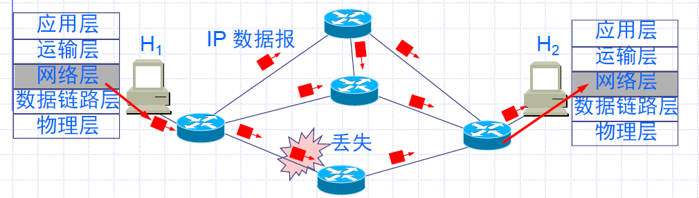

# Chapter 5 网络层

[TOC]

# 1 网络层基本概念

TCP/IP标准中正式定义的第一层

主要功能：**投递分组**

- 编址
- 寻址 - 路由

网际层的IP协议及配套协议

## 1.1 主要协议

### 1.1.1 网际协议（IP）

- IP中的数据单元是**数据报**
- 主要功能：
  - 负责**把数据报交付给主机**
  - IP **不负责**数据交付的可靠性
- IP数据报报头
  - 每一个IP数据报都有一个报头，用于标记数据报以及控制该数据报的管理方式
  - IP报头格式及其内容

### 1.1.2 地址解析协议（ARP）

- 要实现最终通信，IP地址是不够的，需要知道双方的**物理（硬件）地址**，ARP用于获得指定IP地址的**目标主机的物理地址**。
- 使用ARP：主机在网上发送带有目标主机IP地址的广播，只有具有此IP地址的**目标主机会响应该请求**，并发回**含有其物理地址的响应**。

### 1.1.3 网际控制报文协议（ICMP）

- 由于IP的交付是不可靠的，ICMP提供一种机制，用以**向源主机报告IP数据报在交付时出现的一些错误**。
- ICMP消息包含在IP数据报之内，因而能找到回主机的路径
- 常见的ICMP：源停止，目标不可访问等等
- 使用ICMP协议的应用程序实例：ping、traceroute

### 1.1.4 网际组管理协议（IGMP）

- IGMP提供带有**多播组标识**的路由，使整个网络都支持多播
- TCP/IP支持下面三种类型的数据发送：
  - **广播**：把目标地址设为FFFF FFFF FFFF而发送到网上**所有主机**
  - **多播**：数据被交付到网上的一组主机，每台主机**必须注册多播地址**，才能接收指定多播地址的数据
  - **单播**：数据只被交付到**一个指定地址的主机**
- IGMP消息**位于IP数据报中**
- IGMP消息的格式和内容

> 常用网络诊断应用程序
>
> - arp：显示和修改IP-物理地址转换表。
> - ipconfig：列出使用该命令的主机上所有当前TCP/IP网络配置。
> - nslookup：显示域名系统名称服务器的有关信息。
> - netstat：显示协议统计信息以及当前的TCP/IP网络连接。
> - ping：证实与一台或多台远程主机的连接。
> - route：操纵网络路由表。
> - tracert：跟踪本地主机与目标主机之间的连接

## 1.2 网络层提供的两种服务（IP协议基础）

长期争论：网络层应该向运输层提供怎样的服务？“面向连接”还是“无连接”？

争论实质：在计算机通信中，**可靠交付应由谁负责**？**网络**还是**端系统**？

### 1.2.1 虚电路服务

来自电信网的成功经验，让网络负责可靠交付

- **面向连接**的通信方式
- 建立**虚电路**（Virtual Circut），以保证双方通信所需的一切网络资源
- 如果再使用可靠传输的网络协议，就可使所发送的分组无差错按序到达终点。

虚电路表示这只是一条**逻辑上的连接**，分组都沿着这条逻辑连接按照存储转发方式传送，而并不是真正建立了一条物理连接。

注意，==电路交换的电话通信==是先建立了一条**真正的连接**。因此分组交换的虚连接和电路交换的连接只是类似，但并不完全一样。

### 1.2.2 数据报服务（因特网采用的设计思路）

网络层向上只提供简单灵活的、**无连接的**、**尽最大努力交付的数据报服务**。

网络在发送分组时不需要先建立连接。每一个分组（即 IP 数据报）独立发送，**与其前后的分组无关**（不进行编号）。

网络层**不提供服务质量的承诺**。即所传送的分组可能出错、丢失、重复和失序（不按序到达终点），当然也**不保证分组传送的时限**。

尽最大努力交付的好处：

- 由于传输网络==不提供端到端的可靠传输服务==，这就使网络中的**路由器可以做得比较简单**，而且价格低廉（与电信网的交换机相比较）。
- 如果主机（即端系统）中的进程之间的通信需要是可靠的，那么就**由网络的主机中的运输层负责**（包括==差错处理、流量控制等==）。
- 采用这种设计思路的好处是：网络的造价大大降低，运行方式灵活，能够适应多种应用。
- 因特网能够发展到今日的规模，充分证明了当初采用这种设计思路的正确性。

> H1 发送给 H2 的分组可能沿着不同路径传送

虚电路服务与数据报服务的对比

# 2 IP 协议基础

## 2.1 IP数据报

### 2.1.1 网际协议（IP）

- IP提供**无连接**的数据转发，是Internet数据通信的基础
- IP提供的是最底层的、最基础的一部分
- 这种服务是**不提供服务保证**的，分组可能丢失、延迟，也不通知发送方或接受方。一个分组序列有可能沿着不同的路径发送。
- 服务是全力转发，不因为资源耗尽或网络故障而停止，因而会引起丢失等不可靠的情形出现。

### 2.1.2 IP协议中提供的三种重要的内容

- **基本的数据传送单元**，为之指定了精确的数据格式
- **如何实现路由功能**，为数据发送选择路径
- IP还包含一套规则描述主机和路由器应**如何处理数据**，出错数据应何时以及如何产生，丢弃分组的条件

### 2.1.3 互连网络与虚拟互连网络

虚拟互连网络的意义：

- 所谓虚拟互连网络也就是逻辑互连网络，它的意思就是互连起来的各种物理网络的**异构性**本来是客观存在的，但是我们**利用 IP 协议**就可以使这些性能各异的网络从用户看起来好像是一个**统一**的网络。
- 使用 IP 协议的虚拟互连网络可简称为 ==IP 网络==。
- 使用虚拟互连网络的好处是：当互联网上的主机进行通信时，就好像在一个网络上通信一样，**而看不见互连的各具体的网络异构细节**。

### 2.1.4 :star: IP数据报

如果我们只从网络层考虑问题，那么 IP 数据报就可以想象是在网络层中传送。

和帧结构一样，IP数据报也分为两个部分：**数据报头 + 数据报数据域**，即首部+数据部分之和

IP数据报在传送时**封装在帧的数据域**，硬件不能识别IP格式。

详细的数据报头：

- **版本**：4bit，版本号，为4则表示IPv4

- **首部长度**：4bit，==以4B为偏移单位==。一般除了IP OPTIONS 以及相应的PADDING字段可变，其它字段都是固定长，最常见的数据报头是无IP OPTIONS 及PADDING字段，则总长为160bit，**首部长度值为5**（20B）

  > IP首部通常以0X45开头                                                                                                                                                                                                                                                                                                                                                                                                                

- **区分服务**：8bit，指定应如何处理该数据报，它又分为5个子字段：

  - 优先级（3bit）：指定数据报的优先级，可用于拥塞控制，但目前几乎所有的主机和路由器都忽略此信息

  - D（1bit）：设置后表示要求低延迟

  - T（1bit）：设置后表示要求高吞吐量

  - R（1bit）：设置后表示要求高可靠

  - C（1bit）：设置后表示要求费用更低廉的路由

  - 保留位（1bit）

    都用来给路由选择提供建议，但不是一定要执行的。

- **总长度**：16bit，==以1B为偏移单位==。为IP数据报的总长度（==包括头和数据==），其为16比特，因此一个IP数据报可能的最大长度为65535B

- **标识**：16bit，是一个计数器，**唯一标识数据报的整数**。分片时复制所有分片标识号以正确重装

- **标志**：3bit，最后一位MF=1（More Fragment）表示后面还有分片，中间位DF=0（Don’t Fragment）时允许分片

- **片偏移**：13bit，==以8B为偏移单位==。数据报在分片后，**某片在原数据报中的相对位置**。

  > **上述三者控制IP数据报的分片和组合**。
  >
  > IP数据报由软件处理，可在不同版本协议中规定最大长度，但**数据帧长度由硬件限定**。
  >
  > **MTU**：**最大传送单元**，以太网是1500B，FDDI是4470B，广域网不超过576B
  >
  > 1个IP数据报封装成帧时，若数据报总长度（首部+数据）超过MTU，则需要分片（**由路由器完成**）。
  >
  > 片在目的地的网络层被重新组装时，用**片偏移**字段确定片放在原始IP数据报的哪个位置，用标识号确定哪些数据报属于同一个原始数据报的片
  >
  > 一定要看清楚题目给的是总长度（=数据长度+首部长度）还是数据长度；注意片偏移的单位为8B！！
  >
  > 在TCP/IP中，数据报一旦被分片，则在到达目的主机之前就**一直以单独的数据报存在**，在到达主机后，才组合成原始的数据报。
  >
  > 缺点：
  >
  > - 都到接受端主机组合，**效率不高**，且在MTU大的网络中**仍以小的数据报传输**，效率不高
  > - 接受端主机会设置一个**组合计时器**，若超过一个定时，则不再组合为原始数据报，这样只要有一个小的分组不能到达目的地，则整个的原始数据报就出错，这就**有可能增大了整个网络传输出错的概率**。
  >
  > 这也可能是优点，各个小的数据报可以独立路由，**均衡负载**。
  >
  > 在分片后，每一片都与原始的数据报有相同的头格式。总长度字段设置为分片的长度，而非原始数据报的长度

- **生存时间**（TTL，Time To Live）：8bit，数据报在网络中**可通过的路由器数的最大值**，标识数据报在网络中的寿命，确保数据报不会永远在网络中循环。当TTL减为0时，**就把该数据报丢弃**

- **协议**：8bit，指出此数据携带的数据使用何种协议，应上交给哪个**高层协议**处理。

  - TCP - 6；UDP - 17；ICMP；IGMP；OSPF

- **首部校验和**：16bit，只检验数据报的首部，不包括数据部分。数据报每经过一个路由器，都要重新计算首部校验和。**不校验数据部分**，可减少计算的工作量

- **源地址**：32bit，IP地址

- **目的地址**：32bit，IP地址

- 可选字段一般不需要，主要用于网络测试和调试。（记录路由选项，时间戳选项）

## 2.2 IP地址

### 2.2.1 为什么要IP地址？

已有网络设备的物理地址（网卡地址、MAC地址）

- 物理地址只在**两个设备在同一物理网络中时才使用**。IP地址提供了对**远程网络**中的设备进行寻址和访问的方法，它使得网关能容易决定数据报是留在本地网还是传输到其它网络
- 并非所有的网络主机都有网卡，拨号上网的主机无需网卡。利用IP地址可**使拨号主机连接上IP网络**
- 物理地址包括供应商代码(24位)和设备ID(24位)两部分，**用户使用不友好**。IP地址可使得**地址逻辑上有序**，易于理解和组织
- **最重要的是**：IP地址实际上是一种==组织网络==的方式，与物理地址的作用（==区别不同的硬件设备==）完全无关。

### 2.2.2 IPv4

二进制表示：32位。由ICANN分配

点分十进制表示：由二进制变化而来。分成4个8位组，每8位二进制用相应的十进制表示

一个IP地址可分为两部分：

- 前一部分是**网络号**，标识主机所在网络
- 后一部分是**主机号**，标识一台主机
- 两部分分界位置的不同分别对应了不同种类的IP地址，并相应地适合不同种类的网络

### 2.2.3 IP地址的适用范围（ABC等类）

| 网络类别 | 最大网络数         | 第一个可用的网络号 | 最后一个可用的网络号 | 每个网络中最大的主机数 |
| :------- | :----------------- | :----------------- | :------------------- | :--------------------- |
| A        | $2^7-2=126$        | 1                  | 126                  | $2^{24}-2=16777214$    |
| B        | $2^{14}-1=16383$   | 128.1              | 191.255              | $2^{16}-2=65534$       |
| C        | $2^{21}-1=2097151$ | 192.0.1            | 223.255.255          | $2^8-2=254$            |

==A类网络最大网络数减2==是因为：**网络号**字段全为0代表“本网络”，**网络号**为127的IP地址是环回自检地址，二者均需保留；==B、C减1==是因为**网络号**字段全为0代表“本网络”。

==最大主机数减2==是因为：**主机号**全为0表示网络本身，**主机号**全为1表示本网络的广播地址

### 2.2.4 IP地址的重要特点

1. IP 地址是一种**分等级**的地址结构。分两个等级的好处是：
   - 第一，IP 地址管理机构在分配 IP 地址时**只分配网络号**，而剩下的主机号则由得到该网络号的**单位自行分配**。这样就方便了 IP 地址的管理。
   - 第二，路由器仅根据目的主机所连接的**网络号**来转发分组（**而不考虑目的主机号**），这样就可以使**路由表中的项目数大幅度减少**，从而**减小了路由表所占的存储空间**。
2. 实际上 IP 地址是标志**一个主机（或路由器）和一条链路的接口**。
   - 当一个主机同时连接到两个网络上时，该主机就==必须同时具有两个相应的 IP 地址==，其网络号 net-id 必须是不同的。这种主机称为**多归属主机**(multihomed host)。
   - 由于一个路由器至少应当连接到两个网络（这样它才能将 IP 数据报从一个网络转发到另一个网络），因此==一个路由器至少应当有两个不同的 IP 地址==。

### 2.2.5 特殊IP

- 127.x.x.x：环回自检（Loopback Test）地址
- 0.0.0.0：缺省路由
- 网络号全为0：本机IP地址的主机部分
- 主机号全为0：本网络的网络地址
- 主机号全为1：本网络的广播地址（直接广播地址）
- 所有位都是0：本网络的本主机
- 所有位都是1：整个TCP/IP网络的广播地址（受限广播地址），**等效为本网络的广播地址**！
  - 因此，所有位全是1和主机号全是1等价！！

私有地址IP（可重用地址）网段：

A类：1个A类网段，10.0.0.0/8：10.0.0.0~10.255.255.255

B类：16个B类网段：172.16.0.0/12：172.16.0.0~172.31.255.255

C类：256个C类网段：192.168.0.0/16：192.168.0.0~192.168.255.255

- 使用保留地址的网络只能在**内部进行通信**，而**不能与其他网络互连**。
- 因为本网络中的保留地址**同样也可能被其他网络使用**，如果进行网络互连，那么寻找路由时就会因为地址的不唯一而出现问题。
- 但是这些使用保留地址的网络可以通过将本网络内的保留地址**翻译转换成公共地址**的方式（==NAT==）实现与外部网络的互连。

> 在**同一个局域网**上的主机或路由器的 IP 地址中的==网络号必须是一样的==。图中网络号就是 IP 地址中的 net-id
>
> **路由器**总是具有==两个或两个以上的 IP 地址==。路由器的每一个接口都有一个不同网络号的 IP 地址
>
> 两个路由器直接相连的接口处，可指明也可不指明IP 地址。如指明 IP 地址，则这一段连线就构成了一种只包含一段线路的特殊“网络” 。现在**常不指明** IP 地址。
>
> 

### 2.2.6 IP地址与硬件地址

- 在 IP 层抽象的互联网上只能看到 IP 数据报。图中的 IP1→IP2 表示从源地址 IP1 到目的地址 IP2。两个==路由器==的 IP 地址==并不出现==在 IP 数据报的首部中

- 路由器只根据目的站的 IP 地址的网络号进行路由选择
- 在具体的物理网络的链路层，只能看见 MAC 帧而看不见 IP 数据报
- IP层抽象的互联网屏蔽了下层很复杂的细节。在抽象的网络层上讨论问题，就能够使用统一的、抽象的 IP 地址，研究主机和主机或主机和路由器之间的通信

### 2.2.7 网络掩码

TCP/IP网络上的每一台主机都需要一个网络掩码。这个网络掩码或者是一个**默认**的掩码值，或者是一个**自定义**的网络掩码。

默认的网络掩码==用在未被划分为子网的情况==；而自定义的网络掩码用在网络==被划分为子网的情况==中。

**网络掩码**：格式同IP地址（四个字节、每个字节间以点分隔），所有网络位设置为1、所有主机位设置为0。网络掩码与IP地址**进行与运算**可获得相应子网的网络地址。

**默认子网掩码**：

- A类：255.0.0.0
- B类：255.255.0.0
- C类：255.255.255.0

### 2.2.8 网络地址规划

子网划分：将主机位的前n位（子网数 = $2^n – 2$，==这n位子网ID不能全为0或全为1，原因参见下面子网掩码的内容==）作为网络位（即子网ID派生自高位），这样，就出现了多个子网。

IP子网通常用于解决IP资源不足（网络数不足）或重新定向网络数据流和减少网络的拥挤程度。

现在，有些路由器厂家支持 $2^n$​​ 个子网

> 可能的十进制子网掩码号：
>
> 

例子：子网掩码255.255.255.192

### 2.2.9 子网划分和子网掩码

**子网划分**：把单一IP网络划分为几个物理网络。

**为何要做子网划分**：

- **提高地址的利用率**：A类、B类网络地址空间太大，一个网络不可能用完所有地址，为有效使用地址空间，有必要把它们分配给更多较小的网络使用
- **易于网络管理**：小的网络易于管理，大型网络按其中各主机的工作联系或地理位置划分成一些小的网络更易于管理
- **提高网络性能**：通过划分成不同的物理网络，使得网络通信量尽可能==局部化==，减少广播风暴的出现。
- **提高安全性**：通过子网来==隔离网络==或对于特殊要求独立组网。
- **减少Internet核心路由的数目**：所有子网对外只有一个网络号，子网对网外部是不可见的，只有子网内部的路由知道子网划分。

**子网掩码**：

- 网络ID和主机ID的划分是通过给子网中的每台主机**指定子网掩码**来实现的（子网掩码为1则为网络ID，为0则为主机ID）

- 子网掩码的功能：指定网络ID与主机ID的**分界**。

- 子网ID占用一部分原来的主机ID

- 子网ID全0或全1不允许，是因为早期路由协议RIPv1不能携带掩码或者网络ID的长度（网络前缀）

  > 网络前缀：193.1.1.0/27，27代表IP地址中有多少位是用于网络部分，2.2.10中提到

在两个主机进行通信时，IP可以通过==子网掩码==来断定源主机与目标主机**是否处于同一个子网**，从而决定是否要转给路由器。方法：

- 分别把源IP地址和目标IP地址与各自的子网掩码进行“**逻辑位与**”运算。
- 如果得到的网络ID值相同，则认为两个主机是在同一子网，**而无须路由**。否则认为两个主机不在同一子网，**而把数据进行转发**。
- 同一子网的主机必须**配置相同的子网掩码**。子网掩码错误将导致错误的数据发送或接收的路径。

### 2.2.10 无分类编址 CIDR

#### 1 网络前缀

1992年，B类地址已分配了近一半，整个IPv4地址空间将全部耗尽

1987：变长子网掩码（VLSM，Variable Length Subnet Mask）

无分类域间路由选择（CIDR，Classless Inter-Domain Routing）

CIDR主要特点：

- 消除了传统的A类、B类、C类地址及划分子网的概念，可以**更有效地分配IPv4地址空间**
- 使用各种长度的“**网络前缀**”（network-prefix）代替地址中的网络号和子网号
- IP地址从三级编址（使用子网掩码）**回到两级编址**

无分类的两级编址，记法：==IP地址::={<网络前缀>,<主机号>}==

CIDR还使用“**斜线记法**”（slash notation），在IP地址后面加一个斜线“/”，写上网络前缀所占的位数（对应三级编制中子网掩码1的个数）

CIDR把**网络前缀都相同**的连续的IP地址组成“CIDR地址块”

> 对于128.14.32.0，地址块共$2^{12}$个地址，因为主机号有32-20=12位。
>
> 起始最小地址：128.14.32.0，最大地址：128.14.47.255，全0和全1的主机号一般不用

**路由聚合**（route aggregation）：

- 一个CIDR地址块可以表示很多地址，这种地址聚合称为**路由聚合**，使得路由表中的一个项目可以表示很多原来传统分类地址的路由，也称**构成超网**（supernetting）

- ==CIDR虽然不使用子网了，但仍然使用“掩码”这一名词（但不叫子网掩码）==

  > 对于 /20 地址块，它的掩码是 20 个连续的 1。斜线记法中的数字就是掩码中1的个数。

CIDR记法的其他形式

- 10.0.0.0/10 可简写为 10/10，也就是将点分十进制中低位连续的 0 省略。
- 10.0.0.0/10 相当于指出 IP 地址 10.0.0.0 的掩码是 255.192.0.0
- 网络前缀的后面加一个星号 * 的表示方法：如 00001010 00*，在星号 * 之前是网络前缀，而星号 * 表示 IP 地址中的主机号，可以是任意值。

> 考虑192.168.168.0~192.168.175.0这8个C类网络，使用子网掩码255.255.248.0（前21位为1），可以把这8个C类网络逻辑上组成一个网络，192.168.168.12的主机会认为192.168.174.34的主机在同一个子网上，因此这8个C类网络可以用同一个入口
>
> 

#### 2 最长前缀匹配

- 使用 CIDR 时，==路由表==中的每个项目由“**网络前缀**”和“**下一跳地址**”组成。在查找路由表时可能会得到==不止一个匹配结果==。
- 应当从匹配结果中选择具有最长网络前缀的路由：**最长前缀匹配**(longest-prefix matching)。
- 网络前缀越长，其地址块就越小，因而**路由就越具体**。
- 最长前缀匹配又称为**最长匹配**或**最佳匹配**。

> 对于收到的分组目的地址D = 206.0.71.128，路由表中可能``有206.0.68.0/22 和 206.0.71.128/25两个项目
>
> 分别用两个项目的掩码和D按位与，==匹配==且==网络前缀最长==的就是**最长前缀匹配**

#### 3 使用二叉线索查找路由表

- 当路由表的项目数很大时，怎样设法**减小路由表的查找时间**就成为一个非常重要的问题。
- 为了进行更加有效的查找，通常是将无分类编址的路由表存放在一种层次的数据结构中，然后自上而下地按层次进行查找。这里最常用的就是**二叉线索**（binary trie）。
- IP 地址中从左到右的比特值决定了从**根结点逐层向下层延伸的路径**，而二叉线索中的**各个路径就代表路由表中存放的各个地址**。（二叉树深度为前缀长度）
- 为了提高二叉线索的查找速度，广泛使用了各种压缩技术

例子：

## 3 其他协议介绍

### 3.1 地址解析协议 ARP、RARP

网络通讯的地址使用机制：

- 高层—逻辑地址（IP地址）
- 低层—物理地址（MAC地址）
- 数据传输时实际上是采用物理地址

必须实现两种不同类型地址的相互转换：

- ARP（Address Resolution Protocol，地址解析协议）：IP地址 → 物理地址，工作在网络层
- RARP（Reversed ARP，反向地址解析协议）：物理地址 → IP地址

> NAT 工作在传输层，因为“看到了”端口；ARP 工作在网络层，因为“看到了”IP地址

工作原理：主机A向本局域网上的主机B发送IP数据报

1. 在ARP**高速缓存**中查看有无主机B的IP地址
2. 若有，查出对应的硬件地址，写入MAC帧，通过**局域网**将MAC帧发往此硬件地址
3. 若无，通过使用目的MAC地址为`FF-FF-FF-FF-FF-FF`的帧封装并**广播**==ARP请求分组==。主机B收到ARP请求后，向A发送==ARP响应分组==（**单播**）。A收到后将此映射写入ARP缓存，然后按查询到的硬件地址发送MAC帧

### 3.2 网际控制报文协议 ICMP

- 为了提高IP数据报交付成功的机会，网际层使用了网际控制报文协议ICMP（Internet Control Message Protocol）

- ICMP 允许**主机或路由器**报告==差错情况==和提供有关==异常情况==的报告。

- ICMP 不是高层协议，而是 IP 层（网络层）的协议。

- ICMP 报文作为 IP 层数据报的数据，加上数据报的首部，组成 IP 数据报发送出去。

ICMP报文的**格式**：

> ICMP 报文的前 4 个字节是统一的格式，共有三个字段：即类型、代码和检验和。接着的 4 个字节的内容与 ICMP 的类型有关。

**种类**：

- **差错报告报文**，向源点发送，5种

  1. **终点不可达**：路由器或主机**不能交付数据报**
  2. **源点抑制**：路由器或主机因为**拥塞而丢弃**数据报，源点应当把数据报的发送速率放慢
  3. **时间超过**：①**路由器**收到TTL（生存时间）为0的数据报，②**终点**在预先规定时间内不能受到数据报的全部==数据报片==时，全部丢弃，向源点发送时间超过报文
  4. **参数问题**：路由器或目的主机收到的数据包的首部中**有的字段的值不正确**
  5. **改变路由**（重定向）：路由器发送给主机，让主机将数据包发送给另外的路由器

  ICMP 差错报告报文的数据字段的**内容**

  

  不应发送 ICMP 差错报告报文的几种情况：

  - 对 ICMP 差错报告报文不再发送 ICMP 差错报告报文。
  - 对第一个分片的==数据报片==的所有后续数据报片都不发送 ICMP 差错报告报文。
  - 对具有**多播地址**的数据报都不发送 ICMP 差错报告报文。
  - 对具有**特殊地址**（如127.0.0.0 或 0.0.0.0）的数据报不发送 ICMP 差错报告报文。

- **询问报文**，2种

  1. 回送请求和回答报文（应用：PING，测试两个主机之间的连通性）
  2. 时间戳请求和回答报文
