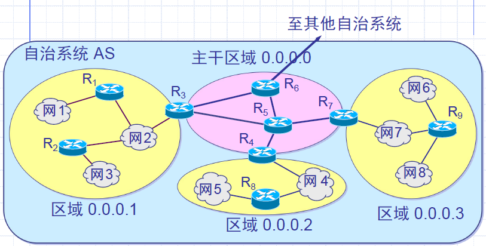

# Chapter 6 IP路由

[TOC]

## 1 路由的基本概念

- 网络层的主要功能是将分组从源端机器经选定的路由送到目的端机器。
- 在绝大多数网络当中分组需要经过多次的转发才能到达目的端机器。
- 路由选择算法和它们所使用的数据结构是网络层设计当中的一个关键问题。

发送端的处理过程：

- 当主机A要和主机B进行通信时，首先判断主机B**是否和它位于同一子网**。

- 方法：把两个主机的IP地址分别与它（==主机A==）的子网掩码（不是各自的！）进行“位与”操作，把分别得到的网络ID进行比较，如果结果相同，则表明位于同一子网，否则位于不同的子网。

  - **如果在同一子网**，则源主机用ARP确定目标主机的**硬件地址**后直接发送数据帧到==目标主机==。（直接路由，无需路由器）

  - **如果不在同一子网**，则源主机用ARP确定默认网关（路由器）的**硬件地址**后，把数据帧转发给==默认网关== （间接路由） 。

- 至此源主机的发送就结束了。

间接路由情形下：路由器把收到的数据帧**解开**，**利用IP包中的地址**选择如何进一步处理

- 如果目的主机在路由器所处的另一个子网，则变成==直接路由==的情况，**封装**IP包，**直接发送**。

- 如果目的主机不在与路由器直接相连的子网，则需要选择==转发到下一个路由器==。通过进行转发，最终到达与目的主机**在同一物理网络的路由**，从而传送到目标主机（最终的一个步骤总是直接路由）。

## 2 路由表

- 路由器为了把收到的数据传送到目标主机，需要知道那些主机是可达的以及如何达到。

- 这些网络拓扑信息由路由器中的路由表保存，路由器通过查找路由表，**选择转发数据的路径**。

### 2.1 下一跳（Next-Hop）路由表

- 一个简化：只保存**目标网络**的路由信息，因为一旦找到目标主机所在的目标网络，就可以直接在物理层传输数据帧了。

- 进一步的简化：不必在每个路由器中都保存一个到目标网络的完整路径，而只保存从本路由器到目标网络的路径的**下一步路由器地址**，这样就可以一步一步达到目标网络了。

- 这种路由方式称为下一跳路由。其路由表的内容是这样的：

  

说明：

- 路由表中通过**指定网络号而非具体的主机**，对主机进行屏蔽。使主机通信依赖于路由器。更主要的是，通过只指定网络，极大地减少了路由表的大小，只有网络数目的增长才会引起路由表的扩大，**而主机的增加对路由表没有影响**。
- 路由表中列出的接口地址**均应与路由器在同一物理网络**，可直接转发物理帧的。
- 还应该指定一个**默认路由**，以确定当==网络号均不匹配时==，如何转发。（当主机只能访问一个路由器时尤其应设置）
- 也可以为了某些目的**为某个主机指定路由**（左边的列就不是网络地址了，而是主机地址）。

问题：

- 一旦路由表给定，所有的流量均将沿**指定的同一路径**转发，即使有多个可选路径。
- 只有最后与目标网络相连的路由器才和目标主机直接通信，前面的路由器**完全不知道目标主机的状态**，如果目标主机已经不存在，那么也只有等数据发到最后一个路由器时才知道。

算法：直接和目的网络匹配 -> 路由表中有主机路由 -> 路由表中有到达目的网络路由 -> 默认路由 -> 发回错误

为何不在路由中直接指定下一跳的物理地址呢？

- **层次分明**，物理地址在低层使用，如果又在网络层使用，则层次不清。下层应该对上层是透明的。
- IP地址**易于管理和维护**，当路由表更新时，查看IP地址比查看物理地址更易明白发生了什么问题。

### 2.2 子网路由

- 当要与子网中的主机进行通信时，除了网络ID，还必须指定子网掩码

- 当选择路由时，就需要把目的主机的IP地址与子网掩码进行“位与”，以确定目标主机所在的网络地址，从而选择下一跳地址。

## 3 IP路由协议

### 3.1 最佳路由，两种路由策略

理想路由算法特点：

关于“最佳路由”：

- **不存在一种绝对的最佳路由算法**。
- 所谓“最佳”只能是相对于某一种特定要求下得出的**较为合理的选择**而已。
- 实际的路由选择算法，应**尽可能接近**于理想的算法。
- 路由选择是个非常复杂的问题：
  - 它是网络中的所有结点共同协调工作的结果。
  - 路由选择的环境往往是不断变化的，而这种变化有时无法事先知道。

**静态路由选择策略**——即非自适应路由选择，其特点是简单和开销较小，但不能及时适应网络状态的变化。

**动态路由选择策略**——即自适应路由选择，其特点是能较好地适应网络状态的变化，但实现起来较为复杂，开销也比较大。

### 3.2 路由表的创建

路由表的创建包含两个方面——初始化路由表和更新路由表

- 初始化路由表取决于操作系统，可能有如下几种情况：
  - 路由器在启动时从二级存储器中**读取一个初始路由表**，并驻留在主存中。
  - 初始路由表为空，在启动后**通过执行外部命令来填充**。
  - 从它所连接的本地网络的地址集**推出一个初始的路由**，并与相邻的路由器**联系**以获得更多的路由信息。
- 初始的路由表建立之后，就需要根据网络路由的变化进行更新。
  - 对于较小的、变化较慢的网络可以由管理员手工来做（静态）；
  - 而对于大的、变化较复杂的网络则很难能由手工完成迅速的更新，就需要一些自动的方法（动态）

对于下一跳路由表，数据是能到达目的网络的，但如何确定所走的路径是到达目的网络的最短路径？

### 3.3 分层次的路由选择协议

- 因特网采用分层次的路由选择协议。规模大，路由器不可能知道所有网络怎样到达；许多单位不希望外界了解内部细节，但仍想连接因特网

**自治系统 AS（Autonomous System）**

- 定义：在单一的技术管理下的一组路由器，而这些路由器使用一种 AS **内部的路由选择协议**和共同的度量以确定分组在该AS 内的路由，同时还使用一种 AS **之间的路由选择协议**用以确定分组在 AS 之间的路由。
- 现在对自治系统 AS 的定义是强调下面的事实：尽管一个 AS 使用了多种内部路由选择协议和度量，但重要的是一个 AS **对其他 AS 表现**出的是一个==单一的和一致的路由选择策略==。

因特网两大路由选择协议

- **内部网关协议** IGP (Interior Gateway Protocol)：即在==一个自治系统内部使用==的路由选择协议。目前这类路由选择协议使用得最多，如 RIP 和 OSPF 协议。
- **外部网关协议** EGP (External Gateway Protocol)：若源站和目的站处在不同的自治系统中，当数据报传到一个自治系统的边界时，就需要使用一种协议将路由选择信息==传递到另一个自治系统中==。这样的协议就是外部网关协议 EGP。在外部网关协议中目前使用最多的是 BGP-4。

自治系统之间的路由选择也叫做**域间路由选择**（interdomain routing），在自治系统内部的路由选择叫做**域内路由选择**（intradomain routing）

在核心路由系统中，通过把所有可能路径的完备信息在核心路由器之间不断传播、更新而使核心路由系统能保有完整、一致、可靠的路由信息。其中的一个关键是路由传播和更新的算法。

两种路由协议的区别：

- 网络规模大小的不同
- 域和域之间的路径度量不同
- 考虑策略不同

## 4 路由信息协议 RIP（Routing Information Protocol）

### 4.1 工作原理

- 路由信息协议 RIP 是内部网关协议 IGP 中**最先得到广泛使用**的协议。
- RIP 是一种分布式的==基于距离向量==的路由选择协议。
- RIP 协议要求网络中的每一个路由器都要维护从它自己**到其他每一个目的网络的距离记录**。

距离：

- 从一路由器到==直接连接==的网络的距离定义为 1。
- 从一个路由器到非直接连接的网络的距离定义为**所经过的路由器数加 1**。
- RIP 协议中的“ 距离” 也称为“**跳数**”（hop count），因为每经过一个路由器，跳数就加 1。
- 这里的“距离”实际上指的是“**最短距离**”，RIP 认为一个好的路由就是它通过的路由器的数目少，即“距离短”。
- RIP 允许一条路径最多**只能包含 15 个路由器**（防止分组在环路上循环，减少网络拥塞）。值为 16 时即相当于不可达。可见 RIP 只适用于小型互联网。
- RIP ==不能==在两个网络之间同时使用多条路由。RIP 选择一个具有**最少路由器**的路由（即最短路由），哪怕还存在另一条高速（低时延）但路由器较多的路由。·

三个要点：

1. 仅和==相邻路由器==交换信息。
2. 交换的信息是当前本路由器所知道的==全部信息==，即自己的**路由表**。
3. 按固定的**时间间隔**==交换路由信息==，例如，每隔 30 秒。

采用距离向量算法。

### 4.2 距离-向量路由算法

==路由表格式：网络 - 距离 - 下一跳路由器==

收到相邻路由器X的RIP报文

1. 修改此==报文中的所有项目==：将“**下一跳**”字段的地址都**改为X**，并且将所有的**“距离”字段＋1**
2. 对修改后的RIP报文的每一个项目，重复以下步骤：
   - 若项目当中的**目的网络不在路由表**中，则**添加**该项目到路由表中
   - 否则：若原来路由表下一跳路由器地址恰同为X，则**用收到项目替换原路由表中的项目**（因为要以更新的消息为准）
   - 否则：若收到项目中的距离小于路由器表当中的距离，则进行更新
   - 否则：什么也不做
3. 若超过3分钟（RIP默认超时时间）没有收到相邻路由器的更新路由表，则将相邻路由距离置16（记相邻路由器不可达）
4. 返回

RIP提出了一些规则来提供性能和可靠性。例如：

- 一旦路由器从别的路由器学习到一个路由，那么它将一致保留直到学到了另一个更好的。（最优，又避免振荡）
- 被动节点在学到一个路由后要立即开始计时，在180秒之内，如果一直没有再次得到关于此路由的广播，则放弃此路由。（宁缺勿错）

### 4.3 RIP中的问题：慢收敛问题

> 考虑如下情况：net1和A断连，尽管net2会及时更新距离为16，但net3的存在会使得net2和net3对于net1的距离缓慢同步上升至16
>
> 
>
> 
>
> 因此，好消息传播快，坏消息传播慢——需要较长时间才能将网络故障信息传播到网络当中所有路由器（慢收敛）

解决方案：

- 水平切割：路由器记录每个接口收到的路由信息，**禁止把一条路由信息从收到它的接口再广播出去**。如上例，可以解决问题，但有些拓扑结构也不行。
- 保持：一旦某个路由器在收到一个网络变为不可达的消息后，它将在一个规定时间区间内**保持此消息而忽略其他路由器发给它的其他消息**（坏消息优先，针对网上：好消息传的快，坏消息传的慢），这样就确保坏消息能先传播出去，而不会在传出去之前就被更新。但会造成一个较长的保持时间，特别对广域网。即使此时有好消息，也不可传播。
- 触发更新：一旦收到消息报告网络不可达，就**立即广播**，不必等下一个广播周期到。同时，在广播中保留此目的网络，只是加一个很大的代价值。但在某些结构中，如多个路由器同时连在某个网络上，此时会造成突然的流量激增。

## 5 内部网关协议 OSPF（Open Shortest Path first）

### 5.1 OSPF 协议的基本特点

- “开放”表明 OSPF 协议不是受某一家厂商控制，而是公开发表的。
- “最短路径优先”是因为使用了 Dijkstra 提出的最短路径算法SPF
- OSPF 只是一个协议的名字，它并不表示其他的路由选择协议不是“最短路径优先”。
- 是分布式的**链路状态协议**。

### 5.2 三个要点

1. **向本自治系统中所有路由器发送信息**，这里使用的方法是==洪泛法==。
2. 发送的信息就是与本路由器**相邻**的所有路由器的链路状态，但这只是路由器所知道的**部分信息**。
   - “链路状态”就是说明本路由器**都和哪些路由器相邻**，以及该链路的“**度量**”(metric)。
3. 只有当**链路状态发生变化**时，路由器才用洪泛法向所有路由器发送此信息。

### 5.3 链路状态数据库（link-state database）

- 由于各路由器之间频繁地交换链路状态信息，因此**所有的路由器最终都能建立**一个链路状态数据库。
- 这个数据库实际上就是**全网的拓扑结构图**，它在全网范围内是一致的（这称为链路状态数据库的同步）。
- OSPF 的链路状态数据库能较快地进行更新，使各个路由器能及时更新其路由表。OSPF 的更新过程**收敛得快**是其重要优点。

### 5.4 OSPF 的区域（area）

- 为了使 OSPF 能够用于规模很大的网络，OSPF 将一个自治系统再划分为若干个更小的范围，叫作区域。
- 每一个区域都有一个 32 位的区域标识符（**用点分十进制表示**）。
- 区域也**不能太大**，在一个区域内的路由器最好不超过 200 个。

划分区域：主干路由器 & 区域边界路由器

- 划分区域的好处就是将利用洪泛法交换链路状态信息的范围局限于每一个区域而不是整个的自治系统，这就**减少了整个网络上的通信量**。
- 在一个区域内部的路由器**只知道本区域的完整网络拓扑**，而不知道其他区域的网络拓扑的情况。
- OSPF 使用层次结构的区域划分。在上层的区域叫作**主干区域**（backbone area）。主干区域的标识符规定为0.0.0.0。主干区域的作用是用来连通其他在下层的区域。

### 5.5 OSPF 的特点

- OSPF 不用 UDP 而是**直接用 IP 数据报传送**。

  - OSPF 构成的**数据报很短**。这样做可==减少路由信息的通信量==。
  - 数据报很短的另一好处是可以==不必将长的数据报分片传送==。分片传送的数据报只要丢失一个，就无法组装成原来的数据报，而整个数据报就必须重传。

- OSPF 对不同的链路可根据 IP 分组的不同服务类型 TOS 而**设置成不同的代价**。因此，OSPF 对于不同类型的业务**可计算出不同的路由**。

- 如果到同一个目的网络有多条相同代价的路径，那么可以将通信量分配给这几条路径。这叫作**多路径间的负载平衡**。

- 所有在 OSPF 路由器之间交换的分组都**具有鉴别的功能**。从而保证仅在可信赖的路由器之间交换链路状态信息。

- 支持可变长度的子网划分和无分类编址 CIDR。

- 每一个链路状态都带上一个 32 位的序号，序号越大状态就越新。

  

### 5.6 OSPF 的五种分组类型

1. **问候**（Hello）分组。运行OSPF的机器周期性地向相邻连接的机器发送Hello报文以测试其可达性。
2. **数据库描述**（Database Description）分组。向邻站给出自己的链路状态数据库中的所有链路状态项目的摘要信息。
3. **链路状态请求**（Link State Request）分组。
4. **链路状态更新**（Link State Update）分组，用洪泛法对全网更新链路状态。
5. **链路状态确认**（Link State Acknowledgment）分组。

基本操作：

OSPF 还规定每隔一段时间，如 30 分钟，**要刷新一次数据库中的链路状态**。

由于一个路由器的链路状态只涉及到==与相邻路由器的连通状态==，因而**与整个互联网的规模并无直接关系**。因此当互联网规模很大时，OSPF 协议要比距离向量协议 RIP 好得多。

OSPF 没有“坏消息传播得慢”的问题，据统计，其响应网络变化的时间小于 100 ms。

**指定的路由器DR**（designated router）：

- **多点接入的局域网**采用了指定的路由器的方法，使广播的信息量大大减少。
- 指定的路由器代表该局域网上所有的链路向连接到该网络上的各路由器发送状态信息。
- 在广播型网络里，Hello报文使用多播地址224.0.0.5周期性广播，选举出一个DR来负责发送状态信息。

### 5.7 OSPF vs RIP

- 根据TOS计算不同路由
- 支持变长子网掩码
- 链路度量灵活
- 支持负载平衡
- 具有路由器鉴别功能

## 6 路由器（Router）

路由器是一个能把**多个异种网络**或网段/子网互联起来，形成一个**综合性的通讯网络**的一种（工作在**网络层**上）的网络设备。

同时它还能对数据传送时进行最佳寻径、流量管理、数据过滤、负荷分流、负载均衡和冗余容错等；高档的路由器还具有数据压缩、传送优先、数据加密等功能。

主要功能：

- **路由器的储存交换**（通常称为封包交换）：它在连接多个独立异种网络或子网时，它对数据信息的传送具有按数据的流向和干路的拥塞情况进行**分组和储存**功能处理，使传送的效果更加理想；再者它对数据交换的同时还具有流量管理、过滤管理、负荷分流、负载均衡及冗余容错等。
- **路由器的最佳路由选径**：是指路由器在传送数据交换时，**能选择一个最佳的路径**，使传送的效果更加理想。