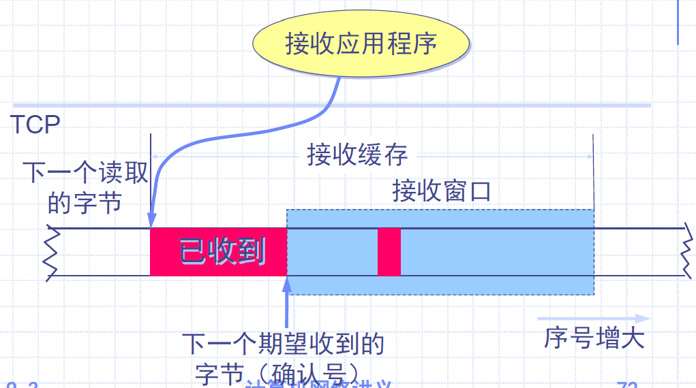
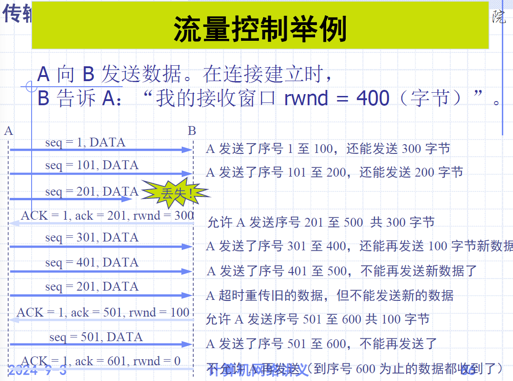

# Chapter 7 传输层

[TOC]

## 1 传输层基本概念

### 1.1 职责

1. 职责：在两个不同系统的==进程==之间提供一种交换数据的可靠机制，协议具有**端到端**的意义。
2. 用户不能对通信子网加以控制，故无法采用更好的通信处理机制来解决网络层服务质量低劣的问题，更不可能通过改进数据链路层纠错能力来改善低层的条件。
3. 传输层的存在使得传输服务比网络服务**更可靠**，报文丢失、残缺等错误都可以被传输层检测到并可以采取相应的补救措施。

### 1.2 传输协议

- 传输协议（Transport protocol）是整个网络体系结构中的关键协议之一
- 实现进程到进程的**可靠**通信服务
- 将多对进程通信**复用**到一条网络连接上
- 向高层用户**屏蔽**了低层通信子网的细节（网络拓扑、协议等）
- 传输层为**应用进程之间**提供逻辑通信，网络层为**主机之间**提供逻辑通信

传输层在系统中的位置：

### 1.3 传输层功能

- **连接管理**
  - 定义允许两个用户像直接连接一样交谈的规则
- **流量控制**（Flow Control）
  - 传输层定义了端用户之间的流量控制，数据链路协议定义了两个中间相邻接点的流量控制
- **差错检测**（Error Detection）
  - 数据链路层提供了可靠的链路传输，但在路由器将含有分组的帧重新格式化，**可能会出现影响分组内容的错误**。帧校验和是在新帧创建后计算的，包含了错误数据。传输层的差错检测用于检测此错误。
- **对用户请求的响应**
  - 包括发送和接收数据
- **建立无连接和面向连接的通信**
- **拥塞控制**（congestion control）

解决的问题：

- 不可靠的网络层服务
- 可靠的通讯需求——提供两种服务TCP和UDP，适应不同的应用需求

### 1.4 传输层协议

- 可靠的，面向连接的，单播（Unicast）协议：**TCP**
  - 拥塞控制（Congestion Control）
  - 流控制（Flow Control）
  - 有连接（Connection Management）
- ==不可靠的==（Best-effort），面向无连接的，单播、多播或广播（multicast、broadcast）的协议：**UDP**

#### 1.4.1 TCP/IP 协议族中的传输层协议

- 用户数据报协议UDP和传输控制协议TCP
- UDP和TCP都使用IP协议，即他们的协议数据单元都作为IP数据报的数据
- UDP是**无连接**的
- TCP提供的是**面向连接**的服务。

### 1.5 端口

#### 1.5.1 端口号定义

- 传输层根据端口号来决定把报文提交给某个应用进程
- **熟知端口**（Well-known port)：IANA负责分配给一些常用的应用程序，范围：0~1023。
  - 如 ftp 21, telnet 23, smtp 25, www 80, tftp 69 等。
- **注册端口**：1024\~49151。IANA不指派也不控制。可在IANA注册以防止重复。
- **动态端口**：49152\~65535。 IANA不指派也不控制。**客户端进程动态生成**。

#### 1.5.2 端口与连接

- 端口标志的是应用
- 一个应用连接用目的与源的IP地址+端口来标识：源IP地址，源端口号；目的IP地址，目的端口号
  - 如：(202.112.29.90, 1025) 和 (202.118.1.60, 23)

> 以上概念同时适用于TCP与UDP，IP地址与端口对即构成套接字Socket

> [!IMPORTANT]
>
> ==（协议、源地址、目的地址、源端口号、目的端口号）==
>
> - 利用这样一个五元组就来**唯一标识一次传输层通信**
> - 套接字（Socket）= (IP 地址：端口号)

## 2 TCP 协议

### 2.1 概述

- TCP协议是专门设计用于在不可靠的网络当中提供**可靠的、端对端的字节流通信协议**。
- TCP协议能够满足不同的拓扑结构、带宽、延迟、分组大小以及其他特性。
- TCP协议在RFC793当中定义，在RFC1122和RFC1323当中得到修订和改进
- 运输实体：负责管理TCP流以及同IP层的接口

- TCP协议具有优良的性能：虽然TCP中包含许多比其它运输层更为复杂的任务，但分析表明，其性能并没有因此而降低。

#### 2.1.1 TCP的特点

- TCP 是**面向连接**的**运输层**协议。
- 每一条 TCP 连接**只能有两个端点**（endpoint），每一条 TCP 连接只能是**点对点**的（一对一）。
- TCP 提供**可靠交付**的服务。
- TCP 提供**全双工**通信，允许通信双方的应用进程在任何时候都能发送数据，为此两端都设有发送缓存和接收缓存。
- 面向**字节流**。

> [!CAUTION]
>
> - TCP 连接是一条**虚连接**而不是一条真正的物理连接。
> - TCP 对应用进程一次把**多长**的报文发送到 TCP 的缓存中是**不关心**的。
> - TCP 根据对方给出的**窗口值**和当前**网络拥塞的程度**来决定一个报文段应包含多少个字节（UDP 发送的报文长度是**应用进程**给出的）。
> - TCP 可把太长的数据块划分短一些再传送。TCP 也可等待积累有足够多的字节后再构成报文段发送出去。

#### 2.1.2 套接字（socket）

TCP 的连接：

- TCP 把**连接**作为最基本的抽象。
- 每一条 TCP 连接有两个**端点**。
- TCP 连接的端点不是主机，不是主机的 IP 地址，不是应用进程，也==不是运输层的协议端口==。TCP 连接的端点叫做**套接字**（socket）或**插口**。
- 端口号**拼接到**（contatenated with）IP 地址即构成了套接字。

套接字（socket）= (IP 地址：端口号)

每一条 TCP 连接唯一地被通信两端的两个端点（即两个套接字）所确定。即：

- TCP 连接 ::= {socket1, socket2} = {(IP1: port1), (IP2: port2)}

### 2.2 报文格式

#### 2.2.1 各字段分析

- **源端口和目的端口字段** —— 各占 2 字节。端口是运输层与应用层的服务接口。运输层的复用和分用功能都要通过端口才能实现。

- **序号字段** —— 占 4 字节。TCP 连接中传送的数据流中的**每一个字节**都编上一个序号。序号字段的值则指的是本报文段所发送的**数据的第一个字节**的序号。

- **确认号字段** —— 占 4 字节，是期望收到对方的**下一个报文段的数据**的第一个字节的序号。

- **数据偏移**（即**首部长度**）——占 4 位，它指出 TCP 报文段的数据起始处距离 TCP 报文段的起始处有多远。“数据偏移”的单位是 32 位字（==以 4 字节为计算单位==）。

  > ==因此，TCP 首部最大长度为 60B==

- **保留字段**——占 6 位，保留为今后使用，但目前应置为 0。

- **紧急 URG** —— 当 URG = 1 时，表明***紧急指针字段***有效。它告诉系统此报文段中**有紧急数据**，应尽快传送（相当于高优先级的数据）。

- **确认 ACK** —— 只有当 ACK = 1 时***确认号字段***才有效。当 ACK = 0 时，确认号无效。

  > TCP 规定，在连接建立后所有传送的报文段都必须把 ACK 置 1

- **推送 PSH (PuSH)** —— 接收 TCP 收到 PSH = 1 的报文段，**就尽快地交付接收应用进程**，而不再等到整个缓存都填满了后再向上交付。

- **复位 RST (ReSeT)** —— 当 RST = 1 时，表明 TCP 连接中出现严重差错（如由于主机崩溃或其他原因），必须释放连接，然后再重新建立运输连接。

  > 还可用于拒绝一个非法的报文段

- **同步 SYN** —— 同步 SYN = 1 表示这是一个**连接**请求或连接接受报文。

  > 当 SYN = 1，ACK = 0 时，表明这是一个连接请求报文
  >
  > 若对方同意建立连接，则置 SYN = 1，ACK = 1

- **终止 FIN (FINish)** —— **用来释放一个连接**。FIN = 1 表明此报文段的发送端的数据已发送完毕，并要求释放运输连接。

- **窗口字段** —— 占 2 字节，用来让对方设置发送窗口的依据，单位为字节。（接收方允许对方发送的字节量）

  > 例，确认号701，窗口字段1000，则表示发送方还有接收1000字节数据（701~1700）的接收缓存空间

- **检验和** —— 占 2 字节。检验和字段检验的范围包括**首部和数据**这两部分。在计算检验和时，要在 TCP 报文段的前面**加上 12 字节的伪首部**。（UDP也是12字节伪首部，检验和也检验首部和数据）

- **紧急指针字段** —— 占 16 位，指出在本报文段中紧急数据共有多少个字节（紧急数据放在本报文段数据的最前面）。

- **选项字段** —— 长度可变，最长40B。TCP 最初只规定了一种选项，即==最大报文段长度 MSS==：是 TCP 报文段中的==数据字段的最大长度==。数据字段加上 TCP 首部才等于整个的 TCP 报文段。

  > 其他选项：窗口扩大选项，时间戳选项，选择确认选项

- **填充字段** —— 这是为了使整个首部长度是 4 字节的整数倍。

#### 2.2.2 伪首部

并不真正传输，但是参与计算校验和。在计算校验和的时候临时生成，同TCP报文连接在一起，得到一个过渡报文，用来计算校验和。格式如下：

> 6 代表协议字段，UDP中为17

- **计算方法**：将得到的临时报文看作n个16bit的字（如果数据字段为奇数个字节就补上一个全零的字节，但是不发送），得到所有这些16bit的字的反码和，校验值就是该和的反码。
- **校验方法**：接受到报文后，连同伪首部和可能的填充字节，进行**反码求和运算**。如果无错误应该得到全1，否则表明有错误出现。

### 2.3 连接管理

#### 2.3.1 连接的建立：三次握手

- 通信双方知道对方存在
- 协商通信参数（最大窗口值、是否使用窗口扩大选项、时间戳选项等）
- 分配运输实体资源（缓存大小、连接表中的项目等）

三段握手协议（Three-way Handshaking）：

0. 连接建立前，服务器处于 ==LISTEN==（收听）状态，等待客户的连接请求

1. 客户机TCP向服务器TCP发送**连接请求报文段**。

   - 报文首部，SYN=1，选择初始序号seq=x

   - 规定：SYN报文段**不能携带数据**（这样就使得第二次握手的ack=x+1），但要消耗掉一个序号。客户机进入 ==SYN-SENT==（同步已发送）状态

2. 服务器TCP收到连接请求报文，若同意建立连接，**发回确认**。为该TCP连接**分配缓存和变量**。

   - SYN=ACK=1，ack=x+1，选择初始序号seq=y。

   - 规定：确认报文段**不能携带数据**，但也要消耗掉一个序号。服务器进入 ==SYN-RCVD==（同步收到）状态

3. 客户端收到确认报文，**向服务器给出确认**。为该TCP连接**分配缓存和变量**。

   - ACK=1，ack=y+1，seq=x+1
   - 该报文段**可以携带数据**，若不携带数据则不消耗序号，客户机进入 ==ESTABLISHED==（已建立连接）状态。服务器收到确认后也进入==ESTABLISHED==状态

#### 2.3.2 连接的释放：四次挥手

- 保证数据被正确接收
- 释放所申请资源

1. 客户机向TCP发送**连接释放报文段**，停止发送数据，主动关闭TCP连接
   - 终止位 FIN=1，seq=u（**前面已传送过数据的最后一个字节序号加一**）即使不携带数据，也要消耗掉一个序号
   - 客户机进入 ==FIN-WAIT-1==（终止等待1）状态
2. 服务器收到后**发出确认**
   - ACK=1，ack=u+1，seq=v（**前面已传送过数据的最后一个字节序号加一**）
   - 服务器进入 ==CLOSE-WAIT==（关闭等待）状态。此时，客户机到服务器方向的连接释放，TCP连接处于==半关闭状态==，但服务器到客户机方向的连接并未关闭。
   - 客户机收到确认后，进入 ==FIN-WAIT-2==（终止等待2）状态，等待**服务器连接释放报文段**
3. 若服务器没有要向客户机发送的数据，就发出**连接释放报文段**
   - FIN=1，seq=w（半关闭状态的服务器可能又发送了一些数据），必须**重复**上次已发送的确认号ack=u+1，ACK=1
   - 服务器进入 ==LAST-ACK==（最后确认）状态
4. 客户机收到连接释放报文段后，发出确认
   - 客户机进入 ==TIME-WAIT==（时间等待）状态。还要经过**时间等待计时器**设置的时间 ==2==MSL（最长报文段寿命，Maximum Segment Lifetime）后，进入 ==CLOSED== 状态
   - ACK=1，ack=w+1，seq=u+1
   - 服务器收到确认后，进入 ==CLOSED==（连接关闭）状态

> 若服务器收到连接释放请求后不再发送数据（CLOSE-WAIT = FIN-WAIT-2 = 0），则：
>
> - 客户机释放连接的最短时间为 1RTT + 2MSL
> - 服务器释放连接的最短时间为 1.5RTT

除时间等待计时器，TCP还有**保活计时器**，当客户主机突然出现故障，使得服务器不再白白等下去

### 2.4 TCP 可靠传输

#### 2.4.1 机制：检验、序号、确认、重传

1. **序号**：保证数据有序提交给应用层。TCP连接传送的数据流**每个字节都编上一个序号**（本报文段所发送数据的第一个字节的序号）

2. **确认**：确认号是期望收到对方的**下一个**报文段的数据的第一个字节的序号

   - 使用**累计确认**，只确认数据流中至第一个丢失字节为止的字节
   - 发送后，发送方缓存区必须存储**已发送但未收到确认**的报文段

3. **重传**

   1. **超时**：设置超时计时器，使用RTO

      ==RTT==：**往返时间**，Round-Trip Time，报文段发出到收到相应确认的时间，方差很大（因为下层是一个互联网环境）

      ==RTTS==：**加权平均往返时间**，随着新测量RTT样本值的变化而变化

      ==RTO==：**超时重传时间**，Retransmission Time-Out，应略大于RTTS，也不能大太多（防止TCP不能很快重传导致数据传输时延大）

      > 具体计算方法见PPT/P77~78
      >
      > Karn算法：只要报文段重传，就不采用其往返时间样本。修正：报文段每重传一次，就把RTO增大一些。

      

   2. **冗余ACK**：当比期望序号大的失序报文段到达时，就再次确认报文段的ACK（冗余ACK）

      **快速重传**：当发送方收到同一报文段的3个冗余ACK时，可认为**跟在被确认报文段后的报文段丢失**。

> PPT：可靠通信，ARQ（自动重传请求），详见数据链路层
>
> 停止等待协议：简单，但信道利用率低；流水线传输
>
> 以字节为单位的滑动窗口
>
> 
>
> 
>
> 

#### 2.4.2 发送缓存和接收缓存

==发送缓存==用来暂时存放：

- **发送应用程序**传送给发送方 TCP 准备发送的数据；（包含发送窗口中允许发送的数据和窗口外不允许发送的数据）
- TCP 已发送出但**尚未收到确认**的数据。

==接收缓存==用来暂时存放：

- 按序到达的、**但尚未被接收应用程序读取**的数据；
- **不按序到达**的数据。

> [!NOTE]
>
> - A 的发送窗口并不总是和 B 的接收窗口一样大（因为有一定的时间滞后）。
> - TCP 标准**没有规定**对不按序到达的数据应如何处理。通常是先**临时存放在接收窗口中**，等到字节流中所缺少的字节收到后，再**按序交付上层的应用进程**。
> - TCP 要求接收方必须有累计确认的功能，这样可以减小传输开销。

选择确认 SACK：接收方收到两个和前面字节流不连续的字节块，若序号在接收窗口内，则接收方先收下，但要把信息准确告诉发送方，使发送方不再重复发送

### 2.5 TCP 流量控制

- 一般说来，我们总是希望数据传输得更快一些。但如果发送方把数据发送得过快，接收方就可能来不及接收，这就会造成数据的丢失。
- **流量控制**（flow control）就是让发送方的发送速率不要太快，既要让接收方来得及接收，也不要使网络发生拥塞。
- 利用==滑动窗口机制==可以很方便地在 TCP 连接上实现流量控制。
- **接收窗口**（rwnd）：由接收方根据当前接收缓存的大小动态调整

**持续计时器**（persistence timer）：

- TCP 为每一个连接设有一个持续计时器。
- 只要 TCP 连接的一方收到对方的**零窗口通知**，就启动持续计时器。
- 若持续计时器设置的时间到期，就发送一个**零窗口探测报文段**（仅携带 1 字节的数据），而对方就在确认这个探测报文段时**给出了现在的窗口值**。
  - 若窗口仍然是零，则收到这个报文段的一方就重新设置持续计时器。
  - 若窗口不是零，则死锁的僵局就可以打破了。

> 必须考虑传输效率。可以用不同的机制来控制 TCP 报文段的发送时机：
>
> 1. TCP 维持一个变量，它等于最大报文段长度 MSS。只要缓存中存放的数据达到 MSS 字节时，就组装成一个 TCP 报文段发送出去。
> 2. 由发送方的应用进程指明要求发送报文段，即 TCP 支持的推送（push）操作。
> 3. 发送方的一个计时器期限到了，这时就把当前已有的缓存数据装入报文段（但长度不能超过 MSS）发送出去。

### 2.6 TCP 拥塞控制

#### 2.6.1 拥塞控制的一般原理

- 出现资源拥塞（congestion）的条件：==对资源需求的总和 > 可用资源==

若网络中有许多资源同时产生拥塞，网络的性能就要明显变坏，整个网络的吞吐量将随输入负荷的增大而下降。

- 拥塞控制是很难设计的，因为它是一个**动态**的问题。
- 当前网络正朝着高速化的方向发展，这很容易出现**缓存**不够大而造成分组的丢失。但分组的丢失是网络发生拥塞的**征兆而不是原因**。
- 在许多情况下，甚至正是**拥塞控制本身**成为引起网络性能恶化甚至发生死锁的原因。这点应特别引起重视。

拥塞控制的作用

#### 2.6.2 拥塞控制与流量控制的关系

- 拥塞控制是让网络能够**承受现有的网络负荷**。是一个==全局性的过程==，涉及到所有的主机、所有的路由器，以及与降低网络传输性能有关的所有因素。
- 流量控制往往指在给定的发送端和接收端之间的==点对点通信量==的控制。所要做的就是**抑制发送端发送数据的速率**，以便使接收端来得及接收。

#### 2.6.3 发送窗口、接收窗口、拥塞窗口

**拥塞窗口 cwnd**：

- 发送方维持**拥塞窗口 cwnd**（congestion window）。大小取决于网络的拥塞程度，并且动态地在变化。发送方让自己的发送窗口等于拥塞窗口。如再考虑到接收方的接收能力，则发送窗口还可能小于拥塞窗口。
- **发送方控制拥塞窗口的原则是**：只要网络没有出现拥塞，拥塞窗口就再增大一些，以便把更多的分组发送出去。但只要网络出现拥塞，拥塞窗口就减小一些，以减少注入到网络中的分组数。

**接收窗口 rwnd**：在流量控制中第一次提到。

发送窗口上限值 = min(rwnd, cwnd)

- 当 rwnd < cwnd 时，是**接收方的接收能力**限制发送窗口的最大值。
- 当 cwnd < rwnd 时，是**网络的拥塞**限制发送窗口的最大值。

#### 2.6.4 慢开始和拥塞避免

发送方由小到大逐渐加大发送窗口（增加的速度很快）；发送窗口缓慢增加

算法流程：

- 在建立连接时设置**慢启动门限 ssthresh**（slow start threshold）的初始值。开始新的连接，拥塞窗口的初始值为1。

- **慢启动**：先发送少量数据探测，若没有发生拥塞，则适当增大拥塞窗口 cwnd。拥塞窗口按**指数**增加，即每连续正确发送了 N 个数据后拥塞窗口值为 $2^N$​
- **拥塞避免**：让拥塞窗口 cwnd 缓慢增大：按照**线性**增加，每次加1（==加法增大==）。
- **网络拥塞的处理**：检测到网络出现拥塞后（超时，**未按时收到确认**），慢启动门限 ssthresh 置为**当前拥塞窗口的一半**（==乘法减小==），同时拥塞窗口 cwnd 变为1。
  - cwnd < ssthresh：慢开始
  - cwnd > ssthresh：停用慢开始，改用拥塞避免
  - cwnd = ssthresh：二者均可

实现举例：

> 注意：若 2cwnd > ssthresh，则下一个RTT后 cwnd 应当置为 ssthresh，即慢开始 cwnd 不可以大于 ssthresh

乘法减小：出现频繁超时时，拥塞窗口指数减小（每次超时，门限窗口减半）

加法增大：避免网络拥塞，线性增加。（达到门限值后线性增加）

> [!IMPORTANT]
>
> - “拥塞避免”并非指完全能够避免了拥塞。利用以上的措施要完全避免网络拥塞还是**不可能的**。
> - “拥塞避免”是说在==拥塞避免阶段==把拥塞窗口控制为按**线性规律增长**，使网络比较不容易出现拥塞。

#### 2.6.4 快重传和快恢复

重复序号立即确认，不等待确认捎带；发送方收到三个重复确认立即重传，不等待超时到达。加法增大。

**快重传**：

- 快重传算法首先要求**接收方**每收到一个失序的报文段后就**立即发出重复确认**（而非等超时计时器超时）。这样做可以让发送方及早知道有报文段没有到达接收方。
- 发送方只要一连收到三个重复确认（冗余ACK）就应当**立即重传**对方尚未收到的报文段。
- 快重传并非取消重传计时器，而是在某些情况下可更早地重传丢失的报文段。（就是三个冗余ACK的用时比超时计时器的时间短的情况）

**快恢复**：

- 当发送端收到连续三个重复的确认时，就执行“乘法减小”算法，==把慢开始门限 ssthresh 减半。但接下去不执行慢开始算法==。
- 由于发送方现在认为网络很可能没有发生拥塞，因此现在不执行慢开始算法，即拥塞窗口 cwnd 现在不设置为 1，而是==设置为慢开始门限 ssthresh 减半后的数值==，然后开始执行拥塞避免算法（“加法增大”），使拥塞窗口缓慢地线性增大。

总结：

- TCP **连接建立**和网络出现**超时**：慢开始和拥塞避免（ssthresh = cwnd/2; cwnd = 1）
- 发送方收到**3个冗余ACK**：快重传和快恢复（ssthresh = cwnd/2; cwnd = ssthresh）

## 3 UDP 协议

为什么需要UDP（User Datagram Protocol）：

- 不需要建立连接
- 简单：发方与收方均不需要维护连接状态
- 包头更小

特性：

- 不可靠，UDP包可能丢失、重复、错序
- 无连接：发方与收方无需握手，每个UDP包单独处理

UDP与IP相比，只是在IP基础上**增加了端口号**

UDP是一个简单的**面向数据报**的运输层的协议，它提供协议端口，使得应用进程能够向其他进程发送数据报，进行进程间的数据通信。

UDP数据报是**无连接、不可靠的。不提供确认、消息反馈控制**，与IP数据报相同。可靠性要需要由应用程序本
身提供。

UDP利用IP进行主机到主机的数据报传输。

UDP数据封装：IP首部+UDP首部+UDP数据

UDP报头：

UDP应用：                                                                                                                                                                                                                                                                                                                                                                                                                                                                                                                                                                                                                                                                                                                                                                                                                                                                                                                                                                                                                                                                                                                                                                                                                                                                                                                                                                                                                                                                                                                                                                                                                                                                                                                                                                                                                                                                                                                                                                                                                                                                                                                                                                                                                                                                                                                                                                                                                                                                                                                                                                                                                                                                                                                                                                                                                                                                                                                                                                                                                                                                                                                                                                                                                                                                                                                                                                                                                                                                                                                                                                                                                                                                                                                                                                                                                                                                                                                                                                                                                                                                                                                                                                                                                                                                                                                                                                                                                                                                                  

- 多媒体应用
  - 对丢包不敏感
  - 多播
- UDP常见应用
  - DNS：域名服务
  - SNMP：简单网络管理协议
  - RIP：路由信息协议
  - P2P：点对点通信
- UDP上的可靠传输

广播与多播：只适用于UDP，而不适用于TCP

组播：采用D类地址：224.0.0.0~239.255.255.255

## 4 NAT（Network Address Translator）

NAT：网络地址转换

NAT技术使得一个**私有网络**可以通过internet注册IP连接到外部世界，位于内网和外网中的NAT路由器在发送数据包之前，负责把**内部IP翻译成外部合法地址**。