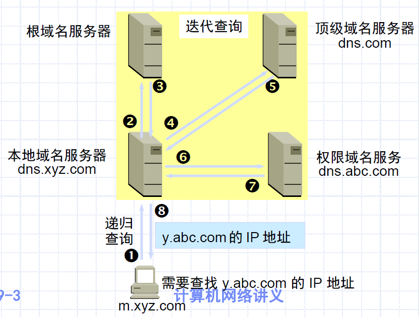
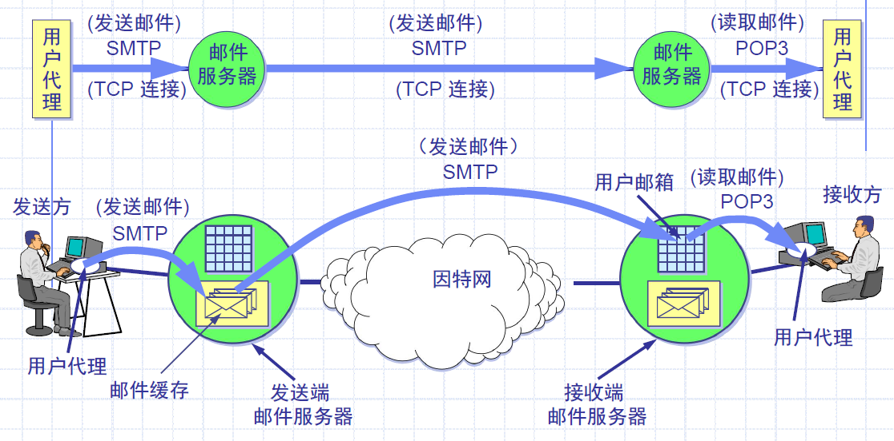
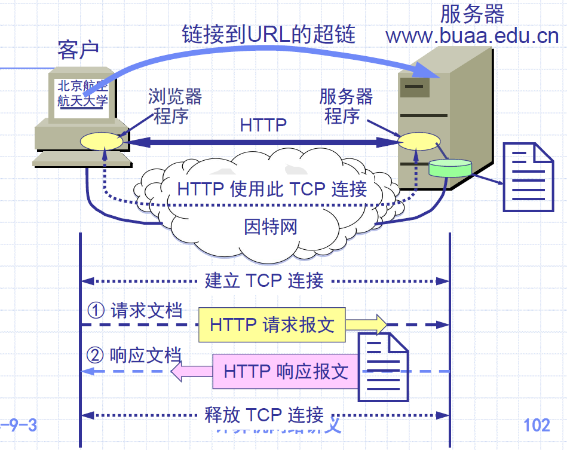
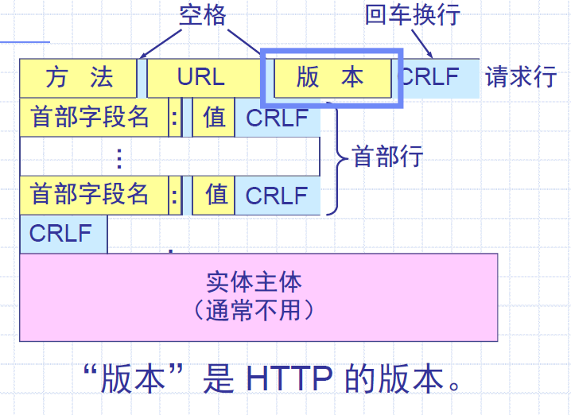
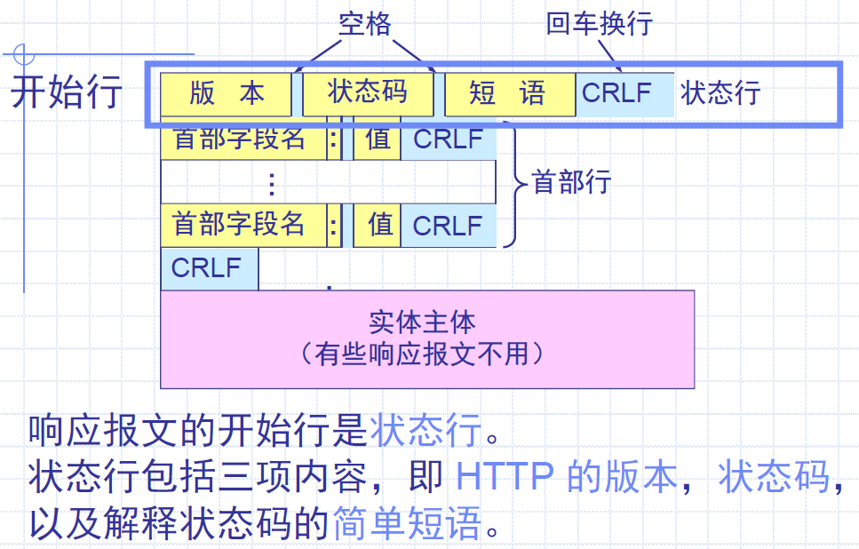

# Chapter 8 应用层

[TOC]

## 1 基本概念、网络应用模型

### 1.1 基本概念

应用层直接为用户提供服务

**应用进程**：

- 为了解决具体的应用问题而**相互通信**的进程
- 运行在**连网主机**的用户空间（User Space）

**应用协议**：

- 应用进程在通信时所遵循的规则、标准与约定
- 定义了应用双方交换的消息格式及相应的动作

**进程间通信**：

- 同一主机内的两个进程：由OS提供的进程间通信机制，如PIPE, FIFO, 共享内存，信号量等
- 不同主机上进程间的通信：**应用协议**

### 1.2 网络应用模型

每个**应用层协议**都是为了解决某一类应用问题，解决问题的过程要求若干个**位于不同主机的进程**相互协同；

应用层规定的就是这些相互协同的进程在通信时所遵守的协议；

根据进程在协同工作时的作用划分为：客户/服务器模型，P2P模型

#### 1.2.1 客户/服务器模型（Client/Server模型）

基本概念

- 参与协同工作的进程往往是**两个**（而不是多个）。
- 客户/服务器模型是传统计算机网络应用的基础。
- 客户/服务器分别指参与一次通信的两个应用实体，客户方是应用服务的**请求者**，服务器是应用服务的**提供者**（最主要的特征）。

**服务的标识**：端口，协议，(110/TCP)。UNIX：/etc/services

**常见应用**：Web、FTP、远程登录、电子邮件等

**特点**：网络中各计算机地位不平等，客户机相互之间不直接通信，可扩展性不佳

#### 1.2.2 P2P模型

参与一次应用服务的进程往往是位于不同主机上的多个进程；参与协同的进程在地位/功能上**对等**（peer to peer）；是一种典型的分布式计算模型。

**应用**：文件共享，媒体播放，数据存储，分布计算等

**优点**：

- 减轻服务器的计算压力
- 多个客户机之间可以直接共享文档
- 可扩展性好
- 网络健壮性强

**缺点**：获取服务同时要为其他节点提供服务，占用较多内存，影响整机速度

## 2 DNS 域名服务

DNS: Domain Name System

域名系统是一个典型的**客户/服务器**交互系统；是一个多层次的、基于域的命名系统，并使用分布式数据库实现这种命名机制。协议运行在**UDP**之上，使用53号端口

### 2.1 层次域名空间

域名：由点号分开的字符数字串组成，最长255个字符，每部分最长63个

顶级域名、二级域名、三级域名……

顶级域名：国际顶级域名（.cn, .uk, .us），国际通用顶级域名（.com, .net, .org）

### 2.2 域名服务器

#### 2.2.1 根域名服务器

是**最高层次**的域名服务器。所有的根域名服务器都知道**所有的顶级域名服务器的域名和 IP 地址**。

不管是哪一个本地域名服务器，若要对因特网上任何一个域名进行解析，只要自己无法解析，**就首先求助于根域名服务器**。

在因特网上共有13 个不同 IP 地址的根域名服务器，它们的名字是用一个英文字母命名，从a 一直到 m（前13 个字母）。

通常器并不直接把域名直接转换成 IP 地址。使用迭代查询时，根域名服务器把下一步应当找的**顶级域名服务器**的 IP 地址告诉本地域名服务器。

#### 2.2.2 顶级域名服务器

负责管理在该顶级域名服务器注册的所有二级域名。

当收到 DNS 查询请求时，就给出相应的回答（可能是最后的结果，也可能是下一步应当找的域名服务器的 IP 地址）。

#### 2.2.3 权限域名服务器

负责一个区（小于等于域）的域名服务器，保存该区中所有主机的域名到IP地址的映射

总能将其管辖的主机名转换为该主机的IP地址

#### 2.2.4 本地域名服务器

当一个**主机**发出 DNS 查询请求时，这个查询请求报文就发送给本地域名服务器。

每一个因特网服务提供者 ISP都可以拥有一个本地域名服务器。有时也称为**默认域名服务器**。

### 2.3 域名解析过程

主机向==本地域名服务器==的查询：**递归查询**。

- 如果主机所询问的本地域名服务器不知道被查询域名的 IP 地址，那么本地域名服务器就以 DNS 客户的身份，向其他==根域名服务器==继续发出查询请求报文。

本地域名服务器向==根域名服务器==的查询：通常**迭代查询**。递归查询少用，因为给根域名服务器造成的负载过大。

- 当根域名服务器收到本地域名服务器的迭代查询请求报文时，要么给出所要查询的 IP 地址，要么告诉本地域名服务器：“你下一步应当向哪一个域名服务器进行查询”。然后让本地域名服务器进行后续的查询。

名字的高速缓存：

- 每个域名服务器都维护一个高速缓存，存放最近用过的**名字**以及从何处获得名字映射信息的**记录**。
- 可大大减轻根域名服务器的负荷，使因特网上的 DNS 查询请求和回答报文的数量大为减少。
- 为保持高速缓存中的内容正确，域名服务器应为每项内容**设置计时器**，并处理超过合理时间的项（例如，
  每个项目只存放两天）。
- 当权限域名服务器回答一个查询请求时，在响应中都指明绑定有效存在的时间值。增加此时间值可减少网络开销，而减少此时间值可提高域名转换的准确性。

## 3 SMTP & POP3 协议

电子邮件：基于TCP，是最广泛的应用之一

### 3.1 电子邮件系统的组成结构

#### 3.1.1 用户代理（User Agent，UA）

用户与电子邮件系统的接口，通常是一个PC程序。

功能：撰写、显示和处理

#### 3.1.2 邮件服务器

功能：发送和接收邮件，同时还要向发信人报告邮件传送的情况（已交付、被拒绝、丢失等）。

按照客户服务器方式工作，但必须能够同时充当客户和服务器。邮件服务器需要使用两个不同的协议。

- SMTP 协议用于**发送**邮件。
- 邮局协议 POP (Post Office Protocol) 用于**接收**邮件。

#### 3.1.3 邮件发送协议和读取协议

邮件发送协议：用户代理向邮件服务器发送，或邮件服务器之间发送邮件：SMTP，Push到SMTP服务器

邮件读取协议：用户代理从邮件服务器读取：POP3，Pull用户邮箱中的邮件

### 3.2 电子邮件格式与MIME

由**信封**和**内容**组成

- 电子邮件传输程序根据邮件信封上的信息传送邮件。用户从自己的邮箱中读取邮件时才能见到邮件的内容
- 信封：最重要的是收信人的地址
- 内容：分为**首部**和**主体**。首部：From, To, Subject，后面要加冒号
- 电子邮件地址格式：收件人邮箱名@邮箱所在主机的域名

多用途因特网邮件扩展（MIME）：邮件中的非ASCII数据通过MIME转换成7位ASCII码数据，用SMTP传送；接收端用MIME逆转换。支持图片视频音频应用等。

### 3.3 SMTP和POP3

#### 3.3.1 SMTP

**简单邮件传输协议**（Simple Mail Transfer Protocol，SMTP），TCP，熟知端口号：25

- 控制两个相互通信的SMTP进程交换信息
- 采用客户/服务器模式，发送邮件的SMTP进程是**客户**，接收邮件的SMTP进程是**服务器**

三个阶段

1. **连接建立**：扫描缓存有邮件，与接收方SMTP服务器建立TCP连接。客户向服务器发送HELO命令
   - 在发送主机的SMTP**客户**和接收主机的SMTP**服务器**之间建立
   - 不使用中间邮件服务器，不管相隔多远或经过多少路由器
2. **邮件传送**：MAIL命令：
   - 客户：FROM；服务器：250 OK
   - 客户：RCPT TO命令（先弄清接收方系统是否已做好接收邮件的准备）；服务器：250 OK 或 550 No such user here
   - 客户：DATA传送邮件，服务器：354 Start email input; end with \<CRLF>.\<CLRF>
3. **连接释放**：邮件发送完毕，SMTP客户发送QUIT命令，服务器：221（服务器关闭），释放TCP链接

#### 3.3.2 POP3

**邮局协议**（Post Office Protocol）：TCP，端口号110

- 客户/服务器模式，接收方的**用户代理**是客户，接收方的**邮件服务器**是服务器

两种工作方式：

- 下载并保留：用户从邮件服务器上读取邮件后，邮件依然会保存在邮件服务器上
- 下载并删除：邮件一旦被读取，就被从邮件服务器上删除

IMAP：

- IMAP 也是按客户服务器方式工作，现在较新的版本是 IMAP4。
- 用户在自己的 PC 机上就可以操纵 ISP 的邮件服务器的邮箱，就像在本地操纵一样。
- 因此 IMAP 是一个联机协议。当用户 PC 机上的 IMAP 客户程序打开 IMAP 服务器的邮箱时，用户就可看到邮件的首部。若用户需要打开某个邮件，则该邮件才传到用户的计算机上。

## 4 HTTP 协议

### 4.1 万维网 WWW

万维网：World Wide Web，是一个大规模的、联机式的信息储藏所。不是某种特殊的计算机网络

万维网用**链接**的方法能非常方便地从因特网上的一个站点访问另一个站点，从而主动地按需获取丰富的信息。

万维网是**分布式超媒体**(hypermedia)系统，它是**超文本**(hypertext)系统的扩充。

一个超文本由多个信息源链接成。利用一个链接可使用户找到另一个文档。这些文档可以位于世界上任何一个接在因特网上的超文本系统中。**超文本是万维网的基础**。

三个标准：

- **统一资源定位符 URL**（Uniform Resource Locator）：标识万维网上的各种文档，使每一个文档在整个因特网的范围内具有惟一的标识符 URL。
  - 对可以从因特网上得到的资源的位置和访问方法的一种简洁表示。
  - 一般形式：<协议>://<主机>:<端口>/<路径>。不区分大小写
  - 协议：http, ftp；主机：存放资源的主机在因特网中的域名或IP地址
- **超文本传输协议 HTTP**（HyperText Transfer Protocol）：使用TCP连接可靠传输，是万维网客户程序与服务器程序之间交互所必须严格遵守的协议
- **超文本标记语言 HTML**（HyperText Markup Language）：文档结构标记语言，对页面上各种信息格式进行描述

工作流程：

1. Web用户使用**浏览器**与Web**服务器**建立连接，发送浏览请求
2. Web服务器把URL转换为文件路径，返回信息给Web浏览器
3. 通信完成，关闭连接

### 4.2 超文本传输协议 HTTP

从层次的角度看，HTTP 是**面向事务的**（transaction-oriented）应用层协议，它是万维网上能够可靠地交换文件（包括文本、声音、图像等各种多媒体文件）的重要基础。

用户点击鼠标后所发生的事件：

1. 浏览器分析超链指向页面的 URL。
2. 浏览器向 DNS 请求解析 www.buaa.edu.cn 的 IP地址。
3. 域名系统 DNS 解析出北航服务器的 IP 地址。
4. 浏览器与服务器建立 TCP 连接
5. 浏览器发出取文件命令：GET /index.htm。
6. 服务器 给出响应，把文件 index.htm 发给浏览器。
7. TCP 连接释放。
8. 浏览器显示文件 index.htm 中的所有文本。

HTTP特点：

- **面向事务**的**客户服务器**协议
- HTTP 1.0是**无状态的**，服务器对同一用户访问的响应相同
- HTTP本身是**无连接的**，尽管使用了面向连接的TCP向上提供的服务

可以使用非持续连接（HTTP/1.0）或持续连接（HTTP/1.1）

- 非持续连接：文档传输时间（正比于文档大小）+2RTT（一个用于TCP连接，一个用于请求和接收文档）
- 持续连接：万维网服务器发送响应后仍保持连接，同一客户和该服务器可继续在这条TCP连接上传送后续HTTP请求和响应报文
  - 分为非流水线方式和流水线方式（客户可以连续发出对各个对象的请求，服务器可以连续响应）

报文结构：

- 请求报文

  

  方法：GET，POST，HEAD，CONNECT等

- 响应报文

  